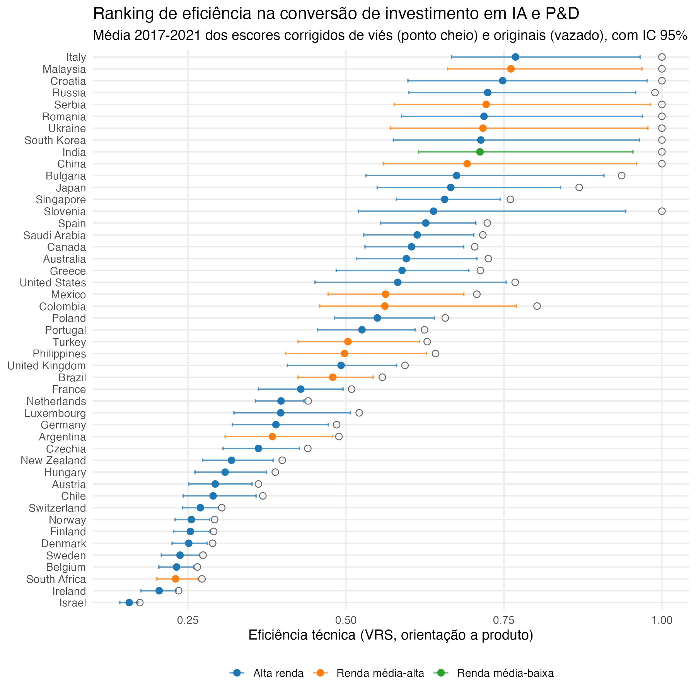
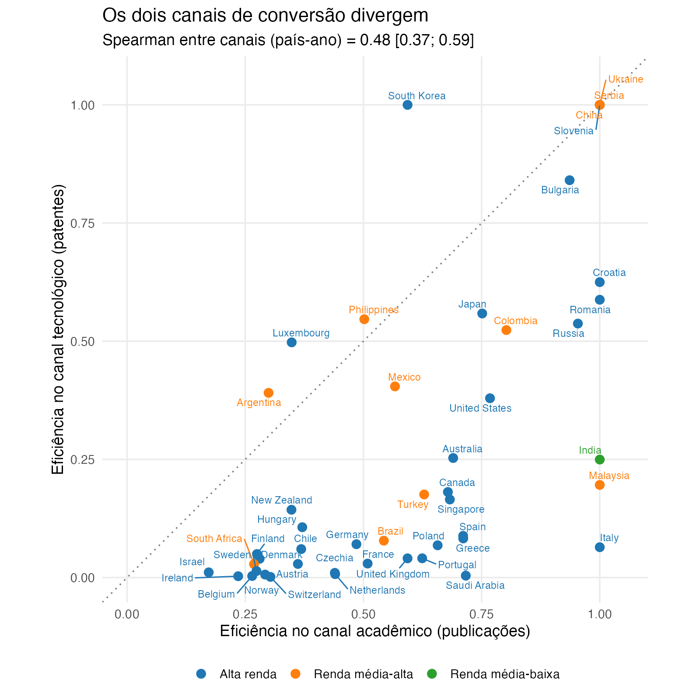
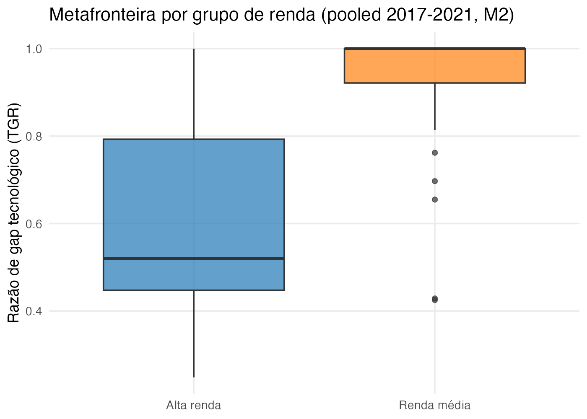
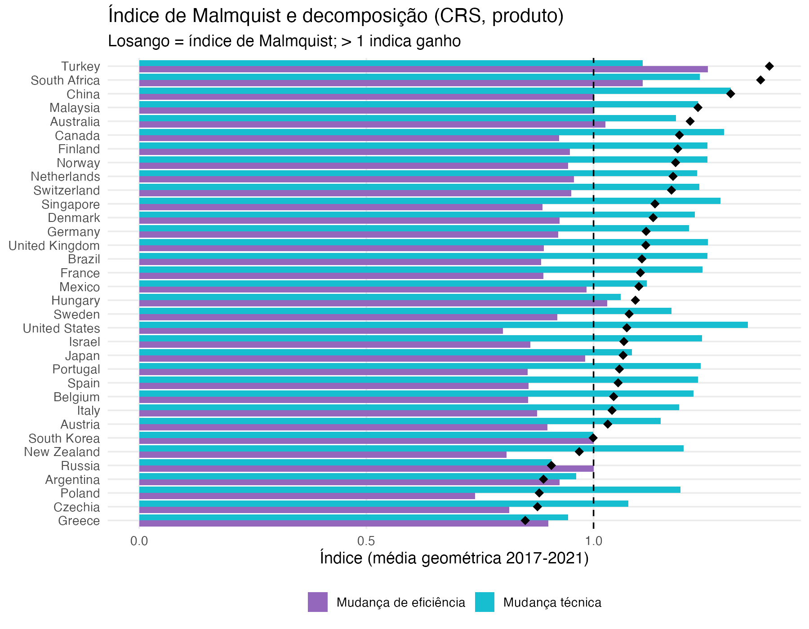
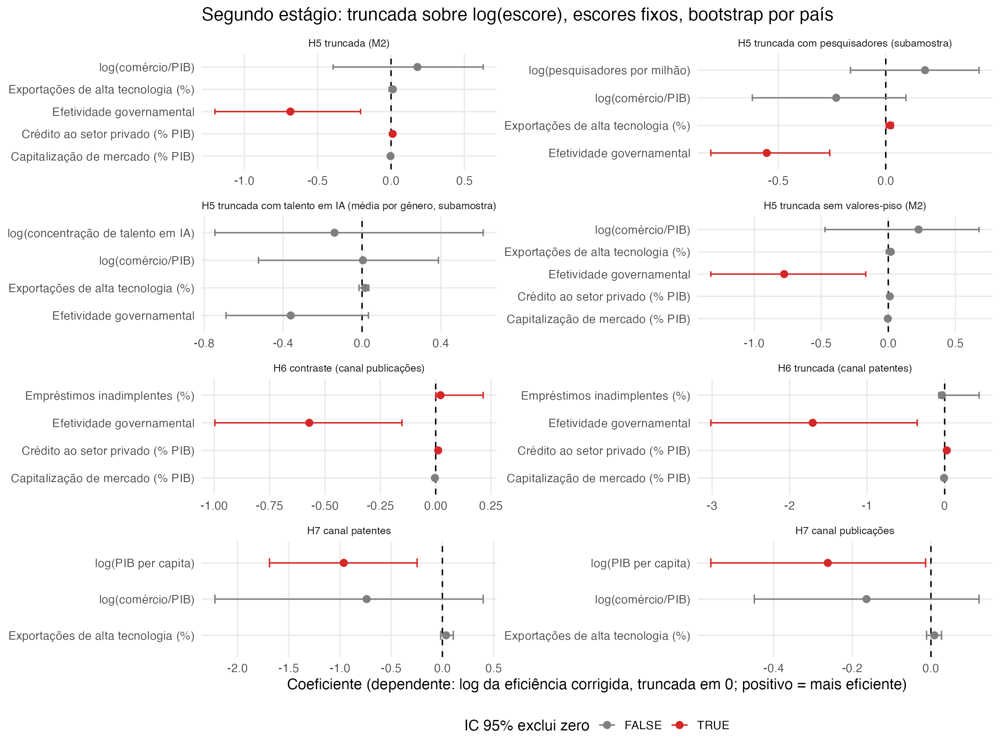
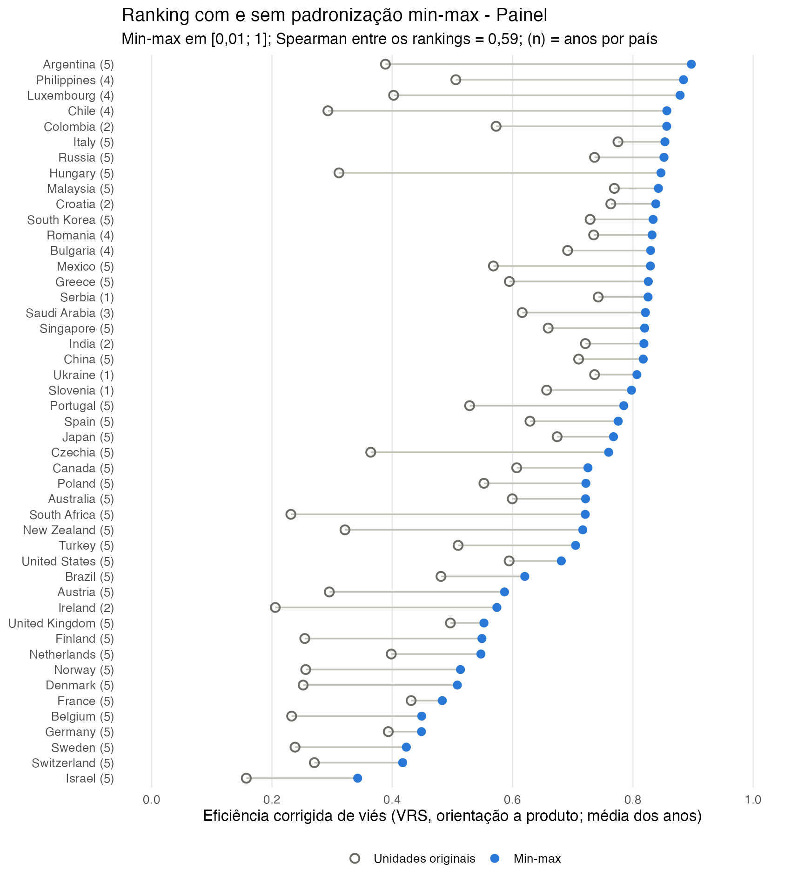

# Eficiência na conversão de investimento em inteligência artificial em ciência e patentes: fronteiras não paramétricas e estocásticas para 47 países (2017–2021)

**Efficiency in converting artificial intelligence investment into science and patents: nonparametric and stochastic frontiers for 47 countries (2017–2021)**

Fernando Silva

> **Notas de trabalho (remover antes da submissão).** Versão de 04/10/2026. Todos os números saem de `output/tables/` (reexecução de 04/10/2026, após a análise crítica 3) e de `manuscrito_descritiva_painel.csv`, gerada por `R/07_tabelas_manuscrito.R`. Pendências que afetam o texto:
> 1. **Periódico e formato.** O CEJOR, candidato desde 28/09, publica em inglês. Para um periódico nacional, ajustar as normas de citação e o limite de palavras.
> 2. **Decisões com o professor** (`artigo/19`):
>    - zeros de investimento: o texto mantém a exclusão, com a justificativa reescrita, e reporta a sensibilidade (seção 3.2);
>    - regra dos três anos no ranking: o texto mostra o ranking completo e o recorte com pelo menos três anos (seção 5.2);
>    - base industrial: fora do modelo, citada como limitação (seção 7).
> 3. **Técnicas do programa ainda não aplicadas:** análise das folgas, ganhos com fusões, TOPSIS e teste de separabilidade de Daraio, Simar e Wilson. O critério de avaliação pede que o manuscrito reflita as metodologias do curso.
> 4. **Rótulos.** No texto, as antigas expectativas E5, E6 e E7 (`artigo/01`) aparecem como expectativas institucional, financeira e de desenvolvimento. Na Figura 5, os painéis ainda se chamam H5, H6 e H7.
> 5. **Autoria e declarações:** afiliação, financiamento, conflito de interesses e disponibilidade do repositório (confirmar se é público).

## Resumo

Este artigo mede a eficiência com que 47 países convertem investimento privado em inteligência artificial (IA) e gasto em pesquisa e desenvolvimento (P&D) em produção científica (artigos de IA) e tecnológica (famílias de patentes de IA) entre 2017 e 2021. Com dados do Center for Security and Emerging Technology e do Banco Mundial, combinam-se análise envoltória de dados com bootstrap, fronteiras robustas order-*m* e order-α, fronteira estocástica por canal, metafronteira por grupo de renda, índice de Malmquist e um segundo estágio exploratório. Os retornos de escala são heterogêneos: as grandes economias ocidentais operam com retornos decrescentes, e China e Coreia do Sul, com retornos constantes, sem indício global contra retornos constantes. A produção responde ao P&D (elasticidades de 0,64 em publicações e 1,41 em patentes), e não ao investimento privado defasado; a hipótese de que o capital privado importa mais para patentes do que para publicações não é apoiada na base principal. A fronteira avançou cerca de 17% ao ano, puxada pela China, mas 22 de 34 países se afastaram dela, e a renda média não se aproximou da alta renda. Com produtos em volume, os países de renda média definem a metafronteira, e a qualidade institucional se associa negativamente à eficiência medida, em todas as dimensões dos indicadores de governança do Banco Mundial. A troca dos produtos por citações e patentes concedidas inverte a metafronteira e atenua essa associação, mas esses dois efeitos não resistem à padronização min-max. Rankings de eficiência em IA baseados em contagens medem, em parte, a escala e a especialização dos sistemas de pesquisa; comparações entre países exigem produtos ajustados por qualidade e patentes atribuídas ao país do inventor.

**Palavras-chave:** inteligência artificial; eficiência; análise envoltória de dados; fronteira estocástica; índice de Malmquist; sistemas nacionais de inovação.

## Abstract

This article measures how efficiently 47 countries converted private investment in artificial intelligence (AI) and research and development (R&D) expenditure into scientific output (AI articles) and technological output (AI patent families) between 2017 and 2021. Using data from the Center for Security and Emerging Technology and the World Bank, it combines bootstrapped data envelopment analysis, order-*m* and order-α robust frontiers, channel-specific stochastic frontiers, an income-group metafrontier, the Malmquist index and an exploratory second stage. Returns to scale are heterogeneous: large Western economies operate under decreasing returns and China and South Korea under constant returns, with no global evidence against constant returns. Output responds to R&D (elasticities of 0.64 for publications and 1.41 for patents), not to lagged private investment; the hypothesis that private capital matters more for patents than for publications is not supported in the main sample. The frontier moved out by about 17% a year, led by China, but 22 of 34 countries fell behind it, and middle-income countries did not catch up with high-income ones. With volume-based outputs, middle-income countries define the metafrontier, and institutional quality is negatively associated with measured efficiency across all dimensions of the World Bank governance indicators. Replacing the outputs with citations and granted patents reverses the metafrontier ordering and weakens that association, although neither effect survives min-max standardization. Count-based AI efficiency rankings partly measure the scale and specialization of research systems; cross-country comparisons require quality-adjusted outputs and patents attributed to the inventor's country.

**Keywords:** artificial intelligence; efficiency; data envelopment analysis; stochastic frontier analysis; Malmquist index; national innovation systems.

**JEL:** O32; O33; O57; D24; C14.

## 1 Introdução

A inteligência artificial (IA) passou a ser tratada como tecnologia estratégica, e indicadores de volume são usados para comparar países: investimento captado por empresas, artigos publicados, patentes depositadas. Volume, porém, não é desempenho. Na amostra deste estudo, a mediana anual do investimento privado em IA, defasado um ano, quase quadruplicou entre 2017 e 2021: foi de US$ 73 milhões para US$ 278 milhões, em dólares de 2021. No mesmo período, a mediana de artigos de IA cresceu 16%, e a de famílias de patentes de IA ficou estável. Para a política científica e tecnológica, a pergunta relevante não é só quem investe mais, mas quem converte melhor os recursos em conhecimento.

A literatura trata essa conversão como uma função de produção de conhecimento (Griliches, 1979; Pakes e Griliches, 1984). Gastos e pessoal de P&D geram produtos codificados, como artigos e patentes, com uma produtividade que depende de dois fatores:
- a capacidade inovadora de cada país (Furman, Porter e Stern, 2002);
- a capacidade de absorver conhecimento externo (Cohen e Levinthal, 1990).

Estudos de eficiência de P&D entre países medem, com análise envoltória de dados (DEA), a distância de cada país à melhor prática observada (Wang e Huang, 2007; Sharma e Thomas, 2008; Guan e Chen, 2012; Cullmann, Schmidt-Ehmcke e Zloczysti, 2012). Em IA, o antecedente direto é o índice de eficiência de Ernst e Mishra (2021), que aplica DEA a 27 países entre 2015 e 2018. Fukuyama, Tan e Wanke (2025) estimam, para 2013–2021, ineficiências nacionais em vários recursos, entre eles as patentes, e as relacionam à corrupção, à democracia e à distribuição de renda.

Três lacunas motivam este estudo:
1. **Inferência.** Os índices de eficiência em IA tratam os escores como determinísticos, sem medir a incerteza de cada posição no ranking.
2. **Insumos e canais.** O capital privado captado por empresas de IA e o P&D executado no país costumam entrar de forma agregada, embora a literatura sugira papéis distintos na produção científica e na tecnológica.
3. **Medida.** Pouco se sabe sobre quanto as conclusões dependem de três escolhas: medir os produtos por volume ou por impacto, atribuir as patentes ao país do primeiro depósito ou ao do inventor, e a fonte do investimento.

Este artigo mede a eficiência de 47 países na conversão de investimento privado em IA e de gasto em P&D em artigos e patentes de IA, entre 2017 e 2021, com dados do Center for Security and Emerging Technology (CSET) e do Banco Mundial. O desenho combina:
- DEA com bootstrap (Simar e Wilson, 1998), FDH e fronteiras robustas order-*m* e order-α;
- teste de retornos de escala (Simar e Wilson, 2002);
- DEA por canal e metafronteira por grupo de renda (O'Donnell, Rao e Battese, 2008);
- índice de Malmquist (Färe et al., 1994);
- fronteira estocástica por canal, com classes latentes;
- segundo estágio exploratório, com regressão truncada, o algoritmo 2 de Simar e Wilson (2007) e Tobit.

São testadas três hipóteses: retornos de escala, especificidade dos insumos por canal e heterogeneidade tecnológica entre grupos de renda. Duas perguntas exploratórias tratam da dinâmica da produtividade e dos determinantes da eficiência. A robustez cobre estimadores, quatro variantes de medida, uma base anterior com 37 países e a padronização das variáveis.

**Resultados principais.**
- Os retornos de escala são heterogêneos, sem indício global contra retornos constantes. Estados Unidos, Alemanha, Reino Unido, França e Japão operam com retornos decrescentes; China e Coreia do Sul, com retornos constantes.
- A produção de conhecimento em IA responde ao P&D, e não ao investimento privado defasado. A hipótese de que o capital privado importa mais para patentes do que para publicações não é apoiada na base principal.
- A fronteira avançou cerca de 17% ao ano, puxada pela China, mas a maioria dos países se afastou dela, e os de renda média não se aproximaram dos de alta renda.
- Com produtos em volume, os países de renda média definem a metafronteira, e a qualidade institucional se associa negativamente à eficiência medida. Quando os produtos passam a medir impacto, a metafronteira se inverte e a associação negativa se atenua.

**Contribuições.**
1. Rankings de eficiência em IA com intervalos de confiança e de postos, que separam as diferenças distinguíveis das que não o são.
2. A separação, por canal e com inferência por bootstrap de país, do papel do capital privado e do P&D: o P&D domina nos dois canais.
3. A demonstração de quais conclusões resistem às escolhas de medida e quais dependem delas. A base do ranking, a heterogeneidade dos retornos de escala, o avanço da fronteira e o sinal negativo das instituições resistem. O topo do ranking, a inversão da metafronteira e o efeito do crédito dependem da medida.

A seção 2 apresenta o referencial e as hipóteses; a 3, os dados; a 4, os métodos; a 5, os resultados; a 6 os discute; e a 7 conclui.

## 2 Referencial teórico e hipóteses

### 2.1 Produção de conhecimento e eficiência dos sistemas de inovação

**Função de produção de conhecimento.** Insumos de P&D, como gastos, pesquisadores e capital, geram produtos codificados, como artigos e patentes (Griliches, 1979; Pakes e Griliches, 1984). Furman, Porter e Stern (2002) levam essa lógica ao nível nacional com o conceito de capacidade inovadora. A produtividade do esforço de P&D depende da infraestrutura comum de inovação, do ambiente dos *clusters* industriais e da qualidade das ligações entre ciência e indústria. Cohen e Levinthal (1990) acrescentam a capacidade de absorção: a parcela do conhecimento externo que um sistema consegue transformar em resultados próprios. Daí o papel do capital humano, das instituições e da abertura comercial como variáveis de contexto.

**Eficiência de P&D entre países.** A literatura com fronteiras de eficiência chega a resultados heterogêneos:
- **Wang e Huang (2007):** com 30 países, estoques de capital e pessoal de P&D como insumos e patentes e publicações como produtos, encontram menos da metade dos países plenamente eficientes e mais de dois terços com retornos crescentes de escala. A maioria tem vantagem relativa nas publicações, e não nas patentes.
- **Sharma e Thomas (2008):** com 22 países desenvolvidos e em desenvolvimento, GERD e pesquisadores como insumos e patentes concedidas a residentes como produto, apontam Japão, Coreia do Sul e China como eficientes sob retornos constantes. Sob retornos variáveis, somam-se Índia, Eslovênia e Hungria.
- **Guan e Chen (2012):** separam, com DEA em rede, a produção de conhecimento e a comercialização em 22 países da OCDE. As posições mudam muito entre as duas etapas, e a eficiência total depende sobretudo da comercialização.
- **Cullmann, Schmidt-Ehmcke e Zloczysti (2012):** mostram, para a OCDE, que barreiras à entrada que reduzem a concorrência diminuem a eficiência de P&D.
- **Holý e Šafr (2018):** na União Europeia, a eficiência é maior nos países de PIB per capita mais alto, com relação muito mais forte na pesquisa aplicada (patentes) do que na básica (citações).
- **Kontolaimou, Giotopoulos e Tsakanikas (2016):** numa metafronteira para países europeus, as economias em desenvolvimento ou em transição têm, em média, o dobro da lacuna tecnológica das desenvolvidas.
- **Carayannis, Goletsis e Grigoroudis (2015):** argumentam que medir a eficiência em vários níveis e etapas dá resultados mais informativos que a medição numa etapa só.

### 2.2 Eficiência em inteligência artificial

**Ernst e Mishra (2021).** O índice de eficiência em IA desses autores, um *working paper*, aplica DEA com retornos constantes a 27 países entre 2015 e 2018:
- **insumos:** matrículas em cursos *online* de IA, investimento privado em empresas de IA per capita e contratações em IA;
- **produtos:** citações de patentes de IA, empresas de IA criadas e artigos e citações de conferências;
- **achados:** subsídios fiscais a P&D estimulam o investimento em empresas de IA, sobretudo onde as barreiras à entrada são altas e os direitos de propriedade, fracos; a propriedade estatal, em especial nas telecomunicações, prejudica a eficiência em patentes.

Os escores são tratados como determinísticos, sem intervalos.

**Fukuyama, Tan e Wanke (2025).** Para 2013–2021, os autores medem ineficiências nacionais em trabalho, capital, energia, patentes, PIB e emissões, com uma tecnologia que admite congestionamento. A ineficiência em patentes predomina na América Latina e Caribe e nos países de renda média. No segundo estágio:
- o controle da corrupção a reduz;
- a democracia e a parcela de renda do 1% mais rico a aumentam.

**A lacuna.** Até onde foi possível verificar, não há, para a IA, estudo que combine inferência estatística, separação dos canais acadêmico e tecnológico, decomposição dinâmica e um exame sistemático da sensibilidade das conclusões às escolhas de medida. A última importa em especial: contagens de artigos e de patentes respondem a incentivos que variam entre países, como os subsídios ao depósito de patentes e as recompensas por publicação, discutidos na seção 6.

### 2.3 Hipóteses e perguntas de pesquisa

**H1 — Retornos de escala.** A tecnologia de produção de conhecimento em IA tem retornos variáveis de escala, e os maiores investidores operam com retornos decrescentes, com parte relevante da distância à fronteira devida à escala.
- **A favor:** se a produção de conhecimento depende de fatores difíceis de expandir na mesma proporção (talento especializado, capacidade de computação, dados), a partir de algum ponto o produto cresce menos que os insumos.
- **Contra:** economias de aglomeração e efeitos de rede sugerem retornos crescentes, e Wang e Huang (2007) encontram retornos crescentes na maioria dos países, para o P&D em geral.
- **Critério:** H1 é avaliada pelo teste de retornos de escala e pela eficiência de escala de cada grande investidor (abaixo de 0,8 para apoio).

**H2 — Especificidade dos insumos por canal.** Controlando pelo P&D executado no país, o investimento privado em IA tem efeito maior sobre as patentes do que sobre as publicações.
- **Fundamentação:** na função de produção de ideias, o esforço de P&D é o insumo central (Furman, Porter e Stern, 2002). Publicações vêm sobretudo de universidades e institutos, e patentes, de empresas. O capital captado por empresas de IA deveria complementar a pesquisa aplicada e aparecer nas patentes.
- **O que os insumos medem:** o setor de execução do P&D e a captação de capital privado, e não fontes de financiamento mutuamente exclusivas. A hipótese trata da complementaridade entre os dois.
- **Critério:** H2 é apoiada quando a elasticidade do investimento em patentes e a diferença patentes − publicações são positivas, com intervalos de 95% acima de zero.

**H3 — Canais e heterogeneidade tecnológica.**
- **H3a:** a eficiência no canal acadêmico e no tecnológico é fracamente correlacionada (ρ < 0,5). Sistemas orientados à ciência e sistemas orientados à comercialização convertem os mesmos recursos em produtos diferentes (Guan e Chen, 2012; Holý e Šafr, 2018).
- **H3b:** os países de renda média operam com uma tecnologia menos favorável que a dos de alta renda. Numa metafronteira por grupo de renda (Battese, Rao e O'Donnell, 2004; O'Donnell, Rao e Battese, 2008), a distribuição da razão de *gap* tecnológico (TGR) do grupo de renda média fica deslocada para baixo, e seu TGR médio é menor, como no achado de Kontolaimou, Giotopoulos e Tsakanikas (2016) para a Europa.

**Por que duas perguntas, e não hipóteses.** Em dois pontos, a inferência disponível não permite refutar previsões:
- os intervalos do índice de Malmquist são descritivos, porque não propagam a incerteza das fronteiras;
- o segundo estágio depende da condição de separabilidade (Daraio, Simar e Wilson, 2018), que não foi testada.

Esses pontos são tratados como perguntas exploratórias.

**RQ1 — Dinâmica.** A mudança de produtividade vem do deslocamento da fronteira ou da aproximação dela? Os países de renda média se aproximam da fronteira mais depressa que os de alta renda? A literatura de difusão e convergência (Färe et al., 1994; Barro e Sala-i-Martin, 1992) sugere que o progresso técnico em IA desloca a fronteira para todos e que quem está longe dela tem mais a aprender.

**RQ2 — Determinantes.** Como a qualidade institucional, o sistema financeiro e o nível de desenvolvimento se associam à eficiência de cada canal? Três expectativas servem apenas para classificar o nível de evidência:
- **institucional:** associação positiva com a efetividade governamental, os pesquisadores per capita e as exportações de alta tecnologia (Furman, Porter e Stern, 2002; Cohen e Levinthal, 1990). Há uma expectativa concorrente: a regulação pode travar a inovação (Cullmann, Schmidt-Ehmcke e Zloczysti, 2012);
- **financeira:** no canal de patentes, capitalização de mercado positiva e crédito bancário não positivo, porque mercados acionários financiam projetos de alto risco e longo prazo, e o crédito bancário, avesso a risco, não (Hsu, Tian e Xu, 2014);
- **desenvolvimento:** PIB per capita positivo no canal de patentes e sem associação positiva no de publicações. É uma extensão à IA do resultado de Holý e Šafr (2018), em que a relação com o desenvolvimento é muito mais forte na pesquisa aplicada do que na básica.

## 3 Dados

### 3.1 Fonte e construção do painel

A base principal é um painel de 47 países construído para este estudo a partir de fontes públicas. Os indicadores de IA vêm do *Country AI Activity Metrics*, do Emerging Technology Observatory, mantido pelo Center for Security and Emerging Technology (CSET) da Universidade de Georgetown (versão 1.12.0, de 15/09/2026; Emerging Technology Observatory, 2026). Os indicadores macroeconômicos e de P&D vêm dos *World Development Indicators* (WDI), e os de governança, dos *Worldwide Governance Indicators* (WGI), ambos do Banco Mundial (World Bank, 2026).

**Insumos.**
- **Investimento privado em IA:** aportes de capital em empresas privadas de IA, somando capital de risco, *private equity* e fusões e aquisições. Excluem-se dívida, subsídios, financiamento coletivo e empresas listadas em bolsa. O CSET imputa o valor dos negócios não divulgados pela mediana do estágio, do país e do ano. A série, em milhões de dólares correntes, foi convertida para dólares de 2021 pelo índice de preços ao consumidor dos Estados Unidos.
- **Gasto interno bruto em P&D (GERD):** P&D executado no país por todos os setores, inclusive empresas, calculado como a razão P&D/PIB (interpolada quando faltante) multiplicada pelo PIB em dólares constantes de 2015.

Os dois insumos entram defasados um ano (t−1): a produção de artigos e o depósito de patentes respondem com atraso ao gasto e ao capital captado.

**Produtos.**
- **Artigos de IA:** contagem anual, apenas anos completos.
- **Famílias de patentes de IA:** atribuídas ao país de prioridade (a jurisdição do primeiro depósito), pelo ano do primeiro depósito, com anos completos até 2021. A série da Índia se quebra a partir de 2019 (270 famílias em 2018 contra 12 em 2019) e foi tratada como faltante a partir desse ano.

**Amostra.** Entram os países com pelo menos 100 artigos de IA em 2016, pelo menos três anos de patentes e seis de investimento, PIB e população em todos os anos e pelo menos três anos de P&D/PIB. O modelo conjunto usa os país-ano com os dois insumos positivos em t−1 e os dois produtos observados: 204 observações de 47 países entre 2017 e 2021, de 39 a 44 países por ano. Os grupos de renda seguem a classificação vigente do Banco Mundial. Na metafronteira, os grupos são dois: alta renda (35 países, 159 observações) e renda média, que reúne a média-alta e a média-baixa (12 países, 45 observações).

**Contexto.** Efetividade governamental, qualidade regulatória, estado de direito e controle da corrupção (WGI; Kaufmann, Kraay e Mastruzzi, 2010); pesquisadores em P&D por milhão de habitantes; exportações de alta tecnologia (% das manufaturadas); comércio (% do PIB); crédito doméstico ao setor privado e capitalização de mercado (% do PIB); empréstimos inadimplentes (% do total); PIB per capita. A concentração de talento em IA, medida no LinkedIn e publicada pelo AI Index (Stanford Institute for Human-Centered Artificial Intelligence, 2025), entra numa especificação alternativa.

A Tabela 1 descreve a amostra. Os insumos e os produtos cobrem várias ordens de grandeza, e as distribuições são muito assimétricas: o investimento defasado vai de US$ 1 milhão a US$ 109 bilhões, com mediana de US$ 170 milhões, e as famílias de patentes, de 1 a 92.950, com mediana de 26.

**Tabela 1** – Estatísticas descritivas da amostra do modelo conjunto (204 país-ano, 47 países, 2017–2021)

| Variável | n | Média | Desvio-padrão | Mínimo | Mediana | Máximo |
|---|---|---|---|---|---|---|
| Investimento privado em IA em t−1 (milhões de US$ de 2021) | 204 | 2.578,5 | 11.175,2 | 1,0 | 170,0 | 109.260,2 |
| GERD em t−1 (bilhões de US$ de 2015) | 204 | 41,2 | 102,9 | 0,4 | 9,9 | 674,7 |
| Artigos de IA | 204 | 4.637 | 9.501 | 160 | 1.638 | 72.439 |
| Famílias de patentes de IA (país de prioridade) | 204 | 2.003 | 9.407 | 1 | 26 | 92.950 |
| WGI: efetividade governamental | 204 | 1,08 | 0,73 | −0,43 | 1,17 | 2,13 |
| WGI: qualidade regulatória | 204 | 0,99 | 0,74 | −0,52 | 1,13 | 2,15 |
| WGI: estado de direito | 204 | 0,85 | 0,90 | −0,99 | 1,09 | 2,10 |
| WGI: controle da corrupção | 204 | 0,90 | 0,97 | −0,96 | 0,81 | 2,33 |
| Pesquisadores em P&D por milhão de habitantes | 172 | 4.065 | 2.318 | 90 | 4.441 | 9.071 |
| Exportações de alta tecnologia (% das manufaturadas) | 203 | 17,5 | 12,9 | 0,3 | 14,1 | 67,0 |
| Comércio (% do PIB) | 204 | 92,2 | 68,2 | 23,1 | 70,6 | 397,5 |
| Crédito doméstico ao setor privado (% do PIB) | 189 | 95,3 | 46,1 | 13,3 | 94,0 | 219,1 |
| Capitalização de mercado (% do PIB) | 159 | 82,5 | 70,6 | 8,4 | 59,5 | 322,7 |
| Empréstimos inadimplentes (% do total) | 191 | 3,8 | 6,2 | 0,2 | 2,1 | 46,0 |
| PIB per capita (US$ de 2015) | 204 | 33.504 | 24.136 | 1.789 | 32.080 | 110.873 |

Fonte: elaboração própria com dados do CSET (Country AI Activity Metrics, v1.12.0) e do Banco Mundial (WDI e WGI). Nota: n é o número de país-ano com a variável observada.

O investimento cresceu muito mais depressa que os produtos. A mediana anual do investimento defasado passou de US$ 73 milhões em 2017 para US$ 278 milhões em 2021; a de artigos, de 1.525 para 1.777; e a de famílias de patentes ficou entre 24 e 27. Como cada mediana é calculada sobre os países com dados no ano (de 39 a 44), a comparação é descritiva. Esse descompasso pesa sobretudo na posição de cada país em relação à fronteira, que é definida pelos melhores.

### 3.2 Problemas de medida

**Zeros e piso do investimento.** O CSET registra o investimento em múltiplos de US$ 1 milhão. No período, 11 país-ano com produtos observados têm investimento defasado igual a zero, e 18 da amostra estão no piso de granularidade (até US$ 2,5 milhões). Em qualquer modelo DEA, uma unidade sem investimento só pode ser comparada a outras sem investimento, porque nenhuma combinação de unidades com investimento positivo usa menos que zero desse insumo. Ela sai, portanto, eficiente ou quase eficiente por construção: o escore médio das 11 unidades é 0,91. Incluí-las também rebaixa as demais, cuja média cai de 0,61 para 0,58, porque uma unidade sem investimento e com produção relevante passa a servir de referência para as outras. O modelo principal exclui os zeros; os resultados com eles e sem as unidades no piso são reportados como sensibilidade.

**Volume e qualidade.** Contagens de artigos e de patentes favorecem sistemas grandes e não distinguem contribuições de impacto diferente. Em 2021, a China registrou 72.439 artigos e 92.950 famílias de patentes de IA, contra 46.801 e 15.629 dos Estados Unidos, com 19% do investimento privado defasado e 52% do GERD americano.

**Atribuição das patentes.** O país de prioridade é o do primeiro depósito, que não coincide necessariamente com o país de residência dos inventores. Inventores de alguns países depositam primeiro em escritórios estrangeiros, e escritórios com grande volume de depósitos domésticos inflam a contagem do próprio país.

**Cobertura do investimento.** O investimento do CSET depende de bases comerciais de transações, cuja cobertura é menor para empresas de baixo perfil e para mercados menos documentados.

### 3.3 Bases de comparação e variantes

Cinco especificações alternativas e uma base anterior testam a sensibilidade dos resultados à medida (Tabela 2):
- **Produtos alternativos:** citações recebidas pelos artigos de IA (até 2020) e famílias de patentes posteriormente concedidas (até 2019), no lugar das contagens. A janela fica restrita a 2017–2019. As duas medidas não isolam qualidade de volume e de tempo de maturação, mas se aproximam mais do impacto.
- **Patentes por inventor:** famílias de patentes de IA depositadas em pelo menos dois dos cinco grandes escritórios (IP5), atribuídas ao país de residência do inventor com contagem fracionária (OCDE, 2026).
- **Preqin:** capital de risco em IA da Preqin, divulgado pelo OECD.AI (2026), no lugar do investimento do CSET. É outro fornecedor e outro universo de transações, só capital de risco.
- **P&D do ensino superior e do governo:** a soma do P&D executado pelo ensino superior (HERD) e pelo governo (GOVERD), no lugar do GERD total (OCDE, 2026; Eurostat, 2026). Não há dado por setor de execução para Brasil, Índia, Malásia, Filipinas, Arábia Saudita e Ucrânia.
- **Base original:** uma base anterior de 37 países (2013–2021), com os indicadores do CSET obtidos via Our World in Data e os insumos no mesmo ano dos produtos. Nela, as patentes vinham por milhão de habitantes e foram reconvertidas em contagem com a população do Banco Mundial.

**Tabela 2** – Amostras por especificação

| Especificação | Janela | DEA (obs./países) | Sem valores-piso | Malmquist (países, painel balanceado) | Segundo estágio institucional (obs./países) |
|---|---|---|---|---|---|
| Painel (base) | 2017–2021 | 204/47 | 186/44 | 34 | 144/38 |
| Produtos alternativos | 2017–2019 | 117/44 | 107/41 | 34 | 85/35 |
| Patentes por inventor | 2017–2021 | 217/46 | 199/45 | 38 | 154/39 |
| Preqin | 2017–2021 | 194/46 | 190/46 | 32 | 136/38 |
| P&D do ensino superior e do governo | 2017–2021 | 184/41 | 168/38 | 32 | 128/34 |
| Base original | 2013–2021 | 191/36 | 169/34 | 16 (2016–2019) | 191/36 |

Fonte: elaboração própria. Nota: "sem valores-piso" exclui as observações com investimento de até US$ 2,5 milhões no insumo usado. O segundo estágio usa os casos completos das variáveis de contexto.

## 4 Método

### 4.1 Por que fronteiras de eficiência

A pergunta deste estudo é de *benchmarking*: quanto cada país produz em relação à melhor prática observada entre países com insumos comparáveis. Regressões com mediação ou moderação estimam efeitos médios de um insumo sobre um produto, eventualmente condicionados por um terceiro fator. Elas não medem a distância de cada unidade à melhor prática, exigem agregar os produtos num índice com pesos arbitrários e impõem uma forma funcional à tecnologia. As fronteiras não paramétricas acomodam vários insumos e produtos sem preços nem pesos fixados de antemão, identificam pares de referência e medem a escala de operação. A fronteira estocástica complementa a análise com elasticidades de produção e separa ruído de ineficiência. Os fatores de contexto entram num segundo estágio, que faz o papel de uma análise de moderação sobre a medida de desempenho.

### 4.2 Análise envoltória de dados e FDH

Cada país i, no ano t, usa os insumos x (investimento e GERD em t−1) para produzir os produtos y (artigos e patentes). Com orientação a produto, a medida de Farrell F é a maior expansão proporcional dos produtos que a tecnologia admite com os mesmos insumos, e o escore de eficiência é 1/F, entre 0 e 1, igual a 1 na fronteira. A orientação a produto corresponde à pergunta de quanto mais conhecimento cada país poderia gerar com os recursos que já tem.

A tecnologia é estimada por análise envoltória de dados (DEA) com retornos constantes (CRS; Charnes, Cooper e Rhodes, 1978), variáveis (VRS; Banker, Charnes e Cooper, 1984) e não crescentes (NIRS), e pelo *free disposal hull* (FDH; Deprins, Simar e Tulkens, 1984), que dispensa a convexidade. As fronteiras são contemporâneas, uma por ano, com 39 a 44 países. A eficiência de escala é a razão entre os escores CRS e VRS. A classificação dos retornos de escala de cada país-ano compara os três modelos: retornos constantes quando os escores CRS e VRS coincidem; decrescentes quando o NIRS coincide com o VRS e difere do CRS; e crescentes nos demais casos.

O modelo principal (M2) tem dois insumos e dois produtos. O modelo de insumo único (M1), só com o investimento, serve de comparação: mostra o que muda quando o P&D fica fora da tecnologia. Os modelos por canal usam os mesmos insumos com um produto de cada vez (só artigos ou só patentes). Os pontos extremos foram examinados pela supereficiência (Andersen e Petersen, 1993) na fronteira agrupada de todos os anos e pelo método de Wilson (1993).

### 4.3 Inferência por bootstrap e ranking

Os escores DEA são estimativas viesadas para cima da eficiência verdadeira e dependem da amostra. O bootstrap suavizado de Simar e Wilson (1998, 2000), com 1.000 réplicas por ano, fornece escores corrigidos de viés e intervalos de confiança; Kneip, Simar e Wilson (2008) discutem a consistência desses procedimentos.

O ranking por país agrega os anos assim:
1. em cada réplica, calcula-se o pseudo-valor 2F̂ − F\* de cada país-ano (limitado em 1), com as réplicas pareadas dentro do ano, porque compartilham a mesma pseudofronteira;
2. a média desses pseudo-valores nos anos de cada país dá o escore corrigido do país; os quantis de 2,5% e 97,5% entre réplicas dão o intervalo de 95%;
3. o posto do país em cada réplica dá o intervalo de postos;
4. contrastes pareados entre os países da base e cada um dos demais indicam quais diferenças são distinguíveis de zero.

### 4.4 Fronteiras robustas

As fronteiras parciais são menos sensíveis a pontos extremos que a DEA e o FDH. No order-*m* (Cazals, Florens e Simar, 2002), cada país é comparado ao desempenho esperado de *m* países sorteados entre os que usam no máximo os seus insumos, com *m* igual ao maior valor entre 5 e 40% dos países do ano. No order-α (Aragon, Daouia e Thomas-Agnan, 2005; Daouia e Simar, 2007), a referência é o quantil α = 0,95 da distribuição condicional dos produtos. A concordância entre estimadores é medida pela correlação de Spearman com o escore VRS, com intervalos por bootstrap em blocos de país.

### 4.5 Teste de retornos de escala

O teste de Simar e Wilson (2002) compara a hipótese nula de retornos constantes (e, em seguida, a de retornos não crescentes) com a alternativa de retornos variáveis, na fronteira agrupada. A estatística é a razão entre a média das distâncias de Shephard sob a nula e a média sob retornos variáveis; valores pequenos indicam evidência contra a nula. A distribuição sob a nula vem de 1.000 réplicas do bootstrap suavizado, e o p-valor é (k + 1)/(B + 1), em que k é o número de réplicas com estatística menor ou igual à observada e B, o de réplicas válidas. A rotina própria segue a construção da implementação de referência (`rDEA::rts.test`).

Uma simulação de Monte Carlo com retornos constantes verdadeiros mostrou que as duas implementações rejeitam a nula em 15% a 25% das amostras ao nível nominal de 5%, com 40 ou 191 unidades. O teste é liberal, e os p-valores servem apenas como diagnóstico.

### 4.6 Canais e metafronteira

A hipótese H3a compara os escores corrigidos dos dois canais pela correlação de Spearman, com bootstrap em blocos de país e p-valor unilateral para a nula ρ ≥ 0,5. Na H3b, a metafronteira (Battese, Rao e O'Donnell, 2004; O'Donnell, Rao e Battese, 2008) é a fronteira VRS agrupada de todas as observações, e as fronteiras de grupo são as de cada grupo de renda. A razão de *gap* tecnológico (TGR) de cada país-ano é a razão entre o escore na metafronteira e o escore na fronteira do seu grupo: TGR = 1 indica que a tecnologia do grupo alcança a melhor tecnologia disponível. A H3b tem dois alvos, ambos condicionais às fronteiras estimadas:
- o deslocamento da distribuição do TGR, pelo teste de Mann-Whitney unilateral, em país-ano e em médias por país;
- a diferença de TGR médio entre os grupos, com intervalo de 95% por bootstrap em blocos de país (1.000 réplicas).

Testes de Kruskal-Wallis (três grupos de renda) e de Mann-Whitney (dois grupos) comparam os escores de cada canal, também em país-ano e em médias por país.

### 4.7 Índice de Malmquist

O índice de Malmquist orientado a produto (Caves, Christensen e Diewert, 1982; Färe et al., 1994) mede a mudança de produtividade entre anos adjacentes, com fronteiras CRS, no painel balanceado (34 países em 2017–2021). Ele se decompõe em mudança técnica (TC), o deslocamento da fronteira no ponto do país, e mudança de eficiência (EC), a aproximação do país em relação à fronteira, o *catch-up*: M = TC × EC. Usa-se a convenção de Färe et al. (1994): valor maior que 1 indica melhora. O pacote `Benchmarking` devolve, nessa orientação, os recíprocos, que são convertidos.

As médias por grupo são geométricas, e os intervalos vêm da reamostragem de países com os índices fixos (1.000 réplicas). Eles não propagam a incerteza da estimação das fronteiras e são apenas descritivos; o bootstrap de Malmquist de Simar e Wilson (1999) não foi implementado. A parcela da mudança técnica na variância do log M rateia a covariância de forma simétrica. A β-convergência é uma regressão por mínimos quadrados da mudança de eficiência média no escore CRS inicial; parte de uma inclinação negativa é mecânica, porque quem começa na fronteira não pode se aproximar dela. Na leitura por país, "na fronteira em todos os anos" exige escore CRS contemporâneo igual a 1 em todos os anos da janela.

### 4.8 Fronteira estocástica por canal

Para cada canal, estima-se, em log, a fronteira

log y_it = β0 + β1 log(investimento_i,t−1) + β2 log(GERD_i,t−1) + δ_t + v_it − u_it,

em que δ_t são efeitos de ano, v é ruído simétrico e u ≥ 0 é ineficiência (Aigner, Lovell e Schmidt, 1977; Meeusen e van den Broeck, 1977). O modelo principal é a Cobb-Douglas com ineficiência meia-normal na amostra agrupada. A robustez usa ineficiência exponencial, translog com os logs centrados na média e dois modelos de painel: ineficiência fixa no tempo (Battese e Coelli, 1988) e variável no tempo (Battese e Coelli, 1992). Um modelo exploratório de duas classes latentes (Orea e Kumbhakar, 2004) verifica se há tecnologias distintas.

Os erros-padrão analíticos supõem observações independentes, mas o mesmo país aparece em vários anos. Os intervalos vêm, por isso, de bootstrap em blocos de país (300 réplicas), com os dois canais estimados no mesmo sorteio. Isso dá o intervalo da diferença entre as elasticidades do investimento nos dois canais e o dos retornos de escala, β1 + β2. Quando o otimizador para sem convergir, o ajuste é reiniciado do próprio ponto final e só é aceito se convergir sem perda de verossimilhança.

O critério de H2 é a especificidade relativa com direção: a hipótese é apoiada quando a elasticidade do investimento em patentes e a diferença patentes − publicações têm intervalos de 95% acima de zero. Só uma das duas condições é apoio parcial. Um efeito significativo num canal e não no outro não testa, por si, a diferença entre eles (Gelman e Stern, 2006). Há veredito apenas quando o ajuste pontual é válido nos dois canais e ao menos 90% das réplicas convergem.

A comparação da DEA com e sem o GERD (M1 × M2) não testa H2. Na DEA orientada a produto, acrescentar um insumo nunca reduz o escore, seja ele relevante ou não.

### 4.9 Segundo estágio

As associações entre o contexto e a eficiência são estimadas por regressão normal truncada sobre o logaritmo do escore corrigido de viés, que fica em (−∞, 0) e é truncado em 0. Essa especificação exploratória tem suporte compatível com o escore e é estável numericamente. Ela não equivale ao modelo de Simar e Wilson (2007) em outra escala: lá, a normal truncada é a da medida de Farrell. O coeficiente se refere à média latente antes da truncagem; a leitura é de sinal, sem efeito percentual sobre o escore. Os escores entram como fixos, e os intervalos vêm de bootstrap agrupado por país (300 réplicas), com a convergência verificada em cada ajuste.

**Especificações.** Todas incluem efeitos de ano.
- **Institucional (modelo conjunto):** efetividade governamental, exportações de alta tecnologia, log do comércio, capitalização de mercado e crédito privado. Variantes:
  - sem as unidades no piso;
  - com pesquisadores por milhão no lugar das variáveis financeiras;
  - com a concentração de talento em IA;
  - com cada uma das outras dimensões do WGI, ou com a média das quatro, no lugar da efetividade.
- **Financeira (canal de patentes):** capitalização de mercado, crédito privado, empréstimos inadimplentes e efetividade governamental; a mesma regressão no canal de publicações serve de contraste.
- **Desenvolvimento (por canal):** log do PIB per capita, exportações de alta tecnologia e log do comércio.

**Comparações.** O algoritmo 2 de Simar e Wilson (2007), na fronteira agrupada, em escala de Farrell (coeficiente positivo indica menor eficiência), com 50 réplicas internas e 500 externas; e um Tobit (Tobin, 1958) sobre o escore corrigido, censurado em 1.

**Níveis de evidência.** Como o segundo estágio é exploratório, cada coeficiente com sinal esperado é classificado, em vez de testado:
- significativo a 5%: o intervalo de 95% exclui zero;
- entre 5% e 10%: só o intervalo de 90% exclui zero;
- só o sinal;
- sinal contrário, em cada um desses níveis.

Quando a expectativa só exclui um sentido, o coeficiente é "compatível", a menos que vá para o sentido excluído com intervalo fora do zero.

### 4.10 Robustez e implementação

A robustez tem três frentes:
- os estimadores (DEA corrigida, M1, FDH, order-*m* e order-α);
- a medida, com as variantes da seção 3.3, comparadas com a base em amostra e fronteira comuns, o que separa o efeito da composição da amostra do efeito da especificação;
- a padronização das variáveis da fronteira.

**Padronização.** A transformação min-max em [ε; 1], com ε = 0,01, é aplicada às quatro variáveis da fronteira, com mínimo e máximo calculados uma vez sobre todas as observações completas. Duas propriedades orientam a leitura:
- os modelos radiais não mudam quando uma variável é multiplicada por uma constante positiva;
- a min-max também soma uma constante a cada variável, e a DEA orientada a produto não é invariante a essa translação dos produtos (Ali e Seiford, 1990; Lovell e Pastor, 1995; Pastor, 1996).

A versão em unidades originais é a principal.

**Implementação.** Tudo foi feito em R 4.5.2 (R Core Team, 2025), com os pacotes:
- `Benchmarking` (Bogetoft e Otto, 2025): DEA, bootstrap, supereficiência e Malmquist;
- `rDEA` (Simm e Besstremyannaya, 2023): algoritmo 2;
- `nonparaeff` (Oh e Suh, 2025): FDH;
- `frontiles` (Laurent e Daouia, 2023): order-*m* e order-α;
- `frontier` (Coelli e Henningsen, 2020) e `sfaR` (Dakpo et al., 2024): fronteira estocástica;
- `truncreg` (Croissant e Zeileis, 2018): regressão truncada;
- `AER` (Kleiber e Zeileis, 2008): Tobit.

Um pipeline único reexecuta todas as etapas, com semente fixa e um manifesto que registra, para cada tabela e figura, a execução e o hash do arquivo.

## 5 Resultados

### 5.1 Escores, escala e retornos (H1)

**Escores.** O escore VRS médio do modelo conjunto é 0,61, com médias anuais entre 0,49 e 0,70; 50 dos 204 país-ano estão na fronteira VRS. O escore médio corrigido de viés é 0,48. Os retornos decrescentes predominam em todos os anos, com exceção de 2018: em 2019, por exemplo, há 32 país-ano com retornos decrescentes, 6 com crescentes e 3 com constantes.

**Retornos por país.** São heterogêneos. Treze dos 47 países operam com retornos decrescentes em todos os anos, entre eles as maiores economias ocidentais e o Japão, com eficiência de escala média de:
- Estados Unidos: 0,26;
- Alemanha: 0,25;
- França: 0,24;
- Reino Unido: 0,24;
- Japão: 0,50.

China e Coreia do Sul operam com retornos constantes nos cinco anos, com eficiência de escala igual a 1, e a Índia, nos dois anos em que tem patentes.

**Teste global.** O teste não fornece indício contra retornos constantes nem contra retornos não crescentes (Tabela 3). Como o tamanho real do teste está em torno de 20%, mesmo um p-valor pequeno não seria conclusivo.

**Tabela 3** – Teste de retornos de escala de Simar e Wilson (2002), fronteira agrupada

| Base | Modelo | Hipótese nula | Estatística S | p-valor | Réplicas válidas |
|---|---|---|---|---|---|
| Painel | M2 | retornos constantes | 0,577 | 0,436 | 970 |
| Painel | M2 | retornos não crescentes | 0,979 | 0,966 | 975 |
| Painel | M1 | retornos constantes | 0,347 | 0,326 | 998 |
| Base original | M2 | retornos constantes | 0,666 | 0,091 | 1.000 |
| Base original | M2 | retornos não crescentes | 0,989 | 0,956 | 999 |
| Base original | M1 | retornos constantes | 0,202 | 0,116 | 1.000 |

Fonte: elaboração própria. Nota: 1.000 réplicas do bootstrap suavizado; réplicas com algum problema de programação linear não resolvido são descartadas. Por simulação, o tamanho real do teste ao nível nominal de 5% fica entre 15% e 25%.

**Retornos no SFA.** A fronteira estocástica dá evidência complementar, por canal (Tabela 5, na seção 5.3):
- **publicações:** retornos decrescentes nas 18 combinações de base e modelo, com limite superior entre 0,70 e 0,89 (no painel, 0,67 [0,56; 0,75]);
- **patentes:** retornos crescentes em 12 combinações, quase sempre com o limite inferior colado em 1 (no painel, 1,29 [1,003; 1,53]), e não distinguíveis de constantes nas outras 6.

**Leitura de H1.** A hipótese não tem apoio conclusivo. O que os dados mostram é heterogeneidade: os grandes investidores ocidentais operam além do tamanho de maior produtividade, e os três grandes sistemas asiáticos, sobre ele. Na fronteira estocástica, dobrar os insumos menos que dobra os artigos; as patentes crescem na mesma proporção dos insumos ou pouco mais.

### 5.2 Ranking com inferência

**Topo.** A Figura 1 e a Tabela A1 (Apêndice A) mostram o escore corrigido médio por país, com intervalo de 95% e intervalo de postos. No topo estão:
- Itália (5 anos), 0,78 [0,72; 0,85];
- Malásia (5), 0,77 [0,71; 0,85];
- Croácia (2), 0,76 [0,62; 0,91];
- Sérvia (1) e Ucrânia (1), 0,74.

A ordem no topo não é distinguível: os intervalos de posto desses cinco países vão de 1–8 a 1–21.

**Base.** Na base estão Suécia (0,24), Bélgica (0,23), África do Sul (0,23), Irlanda (2 anos, 0,21) e Israel (0,16 [0,15; 0,16]). Os contrastes pareados separam a base com clareza:
- Israel fica abaixo dos outros 46 países;
- a Irlanda, de 45;
- a Bélgica e a África do Sul, de 42;
- a Suécia, de 40.

**Grandes economias.** Ocupam posições intermediárias ou baixas: China em 10º (0,71), Japão em 12º (0,67), Estados Unidos em 20º (0,59), Reino Unido em 27º (0,50), Brasil em 28º (0,48), França em 29º (0,43) e Alemanha em 32º (0,39).

**Países com poucos anos.** Sete países têm menos de três anos na amostra (Croácia, Sérvia, Ucrânia, Índia, Eslovênia, Colômbia e Irlanda), e seus intervalos são largos. Entre os 40 países com pelo menos três anos, o topo passa a ser Itália, Malásia, Rússia, Romênia, Coreia do Sul e China, e a base, Suécia, Bélgica, África do Sul e Israel.

**Figura 1** – Ranking de eficiência na conversão de investimento em IA e P&D (média 2017–2021). Pontos cheios: escore corrigido de viés; pontos vazados: escore original; barras: intervalo de 95% por pseudo-valores de Simar e Wilson; entre parênteses, os anos de cada país.
Fonte: elaboração própria.

**Concordância entre estimadores.** É moderada. A correlação de Spearman com o escore VRS é:
- 0,96 [0,93; 0,98] com o escore corrigido;
- 0,82 [0,72; 0,90] com o modelo de insumo único;
- 0,69 [0,53; 0,78] com o FDH;
- 0,65 [0,47; 0,75] com o order-α;
- 0,63 [0,45; 0,75] com o order-*m*.

O order-*m* e o order-α concordam entre si (0,94). As fronteiras parciais penalizam menos os vizinhos de observações extremas, o que explica a concordância menor com a DEA.

### 5.3 Insumos por canal (H2)

H2 não é apoiada na base principal (Tabela 4). No painel, a elasticidade do investimento defasado em patentes não se distingue de zero em nenhum dos três modelos (−0,12 no agrupado; 0,04 e 0,05 nos de painel). A diferença entre canais também não se distingue de zero. O efeito em publicações é pequeno, 0,03, e só aparece nos modelos de painel. Com o P&D do ensino superior e do governo como controle, a especificação mais próxima do enunciado de H2, não há efeito em patentes em nenhum modelo.

**Placar nas 18 combinações de base e modelo:**
- **apoiada em 3:** os dois modelos de painel da base original e, no limite, o agrupado com patentes por inventor, cujo limite inferior da diferença (0,0008) fica acima de zero em 17 de 20 sementes do bootstrap;
- **apoio parcial em 2:** os modelos de painel da variante de produtos alternativos, com efeito em patentes, sem diferença entre canais;
- **não apoiada em 13.**

Nenhuma combinação contraria H2. Quando o investimento privado tem efeito, ele é pequeno: elasticidade de 0,01 a 0,21 nos casos significativos.

**Tabela 4** – Elasticidade do investimento privado em IA por canal (fronteira estocástica em log; ponto e intervalo de 95% por bootstrap em blocos de país)

| Base | Modelo | Publicações | Patentes | Patentes − publicações | H2 |
|---|---|---|---|---|---|
| Painel (base) | Agrupado | 0,03 [−0,07; 0,13] | −0,12 [−0,30; 0,10] | −0,15 [−0,34; 0,09] | não apoiada |
| Painel (base) | Painel BC88 | 0,03 [0,01; 0,06] | 0,04 [−0,03; 0,15] | 0,01 [−0,07; 0,12] | não apoiada |
| Painel (base) | Painel BC92 | 0,03 [0,01; 0,06] | 0,05 [−0,04; 0,17] | 0,02 [−0,08; 0,14] | não apoiada |
| P&D ES + gov. | Agrupado | 0,05 [−0,05; 0,15] | 0,04 [−0,17; 0,20] | −0,02 [−0,20; 0,16] | não apoiada |
| P&D ES + gov. | Painel BC88 | 0,02 [0,004; 0,03] | 0,07 [−0,04; 0,17] | 0,05 [−0,05; 0,16] | não apoiada |
| P&D ES + gov. | Painel BC92 | 0,01 [0,0001; 0,03] | 0,05 [−0,06; 0,17] | 0,04 [−0,08; 0,16] | não apoiada |
| Patentes por inventor | Agrupado | 0,06 [−0,04; 0,16] | 0,21 [0,08; 0,35] | 0,15 [0,001; 0,28] | apoiada (no limite) |
| Patentes por inventor | Painel BC88 | 0,03 [0,01; 0,04] | 0,04 [−0,02; 0,11] | 0,02 [−0,05; 0,09] | não apoiada |
| Patentes por inventor | Painel BC92 | 0,03 [0,01; 0,05] | 0,04 [−0,02; 0,11] | 0,01 [−0,06; 0,09] | não apoiada |
| Preqin | Agrupado | 0,02 [−0,10; 0,14] | 0,25 [−0,01; 0,47] | 0,23 [−0,003; 0,45] | não apoiada |
| Preqin | Painel BC88 | 0,03 [0,003; 0,06] | 0,11 [−0,06; 0,22] | 0,08 [−0,09; 0,19] | não apoiada |
| Preqin | Painel BC92 | 0,03 [−0,001; 0,06] | 0,11 [−0,06; 0,24] | 0,08 [−0,10; 0,20] | não apoiada |
| Produtos alternativos | Agrupado | 0,19 [0,05; 0,30] | −0,04 [−0,31; 0,17] | −0,23 [−0,46; 0,04] | não apoiada |
| Produtos alternativos | Painel BC88 | 0,09 [0,04; 0,14] | 0,14 [0,05; 0,26] | 0,05 [−0,05; 0,16] | apoio parcial |
| Produtos alternativos | Painel BC92 | 0,09 [0,04; 0,14] | 0,14 [0,05; 0,26] | 0,05 [−0,05; 0,18] | apoio parcial |
| Base original | Agrupado | 0,10 [−0,05; 0,25] | 0,09 [−0,14; 0,27] | −0,01 [−0,22; 0,20] | não apoiada |
| Base original | Painel BC88 | 0,02 [−0,001; 0,07] | 0,14 [0,05; 0,21] | 0,12 [0,03; 0,20] | apoiada |
| Base original | Painel BC92 | 0,02 [−0,001; 0,04] | 0,15 [0,05; 0,24] | 0,13 [0,03; 0,23] | apoiada |

Fonte: elaboração própria. Notas: modelo agrupado = Cobb-Douglas com ineficiência meia-normal; BC88 e BC92 = Battese e Coelli (1988, 1992). Investimento e P&D em t−1 no painel e nas variantes; no mesmo ano na base original. 300 réplicas; todas as combinações têm ajuste válido e de 294 a 300 réplicas convergentes. ES + gov. = P&D executado pelo ensino superior e pelo governo.

**O insumo que importa é o P&D.** A elasticidade do P&D é grande e significativa em todas as bases (Tabela 5): no painel, 0,64 em publicações e 1,41 em patentes. Na mesma especificação, a do investimento privado é 0,03 e −0,12. A correlação entre o log do investimento e o log do P&D, de 0,74 a 0,82 conforme a base, explica parte da imprecisão do coeficiente do investimento.

**Identificação da ineficiência.** No corte agrupado, a ineficiência não é identificada em publicações. O resíduo de mínimos quadrados tem assimetria positiva, o sinal errado para uma fronteira de produção, e o SFA recai em mínimos quadrados (γ = 0). Em patentes, a razão de verossimilhança só rejeita a ausência de ineficiência em duas bases. Nos modelos de painel ocorre o oposto: γ fica entre 0,93 e 1,00, porque toda diferença persistente entre países passa a contar como ineficiência, como na crítica de Greene (2005).

**Tabela 5** – Elasticidade do P&D e retornos de escala no modelo agrupado (ponto e intervalo de 95% por bootstrap em blocos de país)

| Base | P&D, publicações | P&D, patentes | Retornos, publicações | Retornos, patentes | Razão de verossimilhança da ineficiência (p), publicações / patentes |
|---|---|---|---|---|---|
| Painel (base) | 0,64 [0,51; 0,77] | 1,41 [0,99; 1,74] | 0,67 [0,56; 0,75] | 1,29 [1,003; 1,53] | 0,499 / 0,097 |
| P&D ES + gov. | 0,70 [0,55; 0,85] | 1,36 [0,94; 1,80] | 0,75 [0,56; 0,85] | 1,40 [0,9997; 1,76] | 0,452 / 0,451 |
| Patentes por inventor | 0,60 [0,47; 0,75] | 0,94 [0,69; 1,16] | 0,67 [0,56; 0,75] | 1,16 [1,001; 1,29] | 0,499 / 0,499 |
| Preqin | 0,67 [0,51; 0,81] | 1,01 [0,65; 1,39] | 0,68 [0,57; 0,77] | 1,26 [1,01; 1,47] | 0,499 / 0,013 |
| Produtos alternativos | 0,61 [0,43; 0,79] | 1,40 [0,96; 1,65] | 0,79 [0,70; 0,89] | 1,36 [1,02; 1,49] | 0,499 / < 0,001 |
| Base original | 0,59 [0,39; 0,78] | 1,17 [0,79; 1,49] | 0,69 [0,55; 0,79] | 1,25 [0,92; 1,45] | 0,499 / 0,195 |

Fonte: elaboração própria. Notas: retornos = soma das elasticidades do investimento e do P&D, calculada em cada réplica. O teste de razão de verossimilhança usa a mistura de qui-quadrados com 0 e 1 grau de liberdade; p ≈ 0,5 corresponde a γ = 0.

### 5.4 Canais e metafronteira (H3)

**H3a, canais.** A correlação entre a eficiência no canal acadêmico e no tecnológico é moderada: 0,48 [0,30; 0,63] no painel, com p = 0,37 para a nula ρ ≥ 0,5. A hipótese é inconclusiva. Só a variante com patentes por inventor rejeita a nula: 0,30 [0,04; 0,50], p = 0,027.

A Figura 2 mostra perfis distintos de especialização:
- **Coreia do Sul:** eficiente em patentes e intermediária em publicações;
- **Itália, Malásia e Índia:** eficientes em publicações e pouco eficientes em patentes;
- **China, Sérvia, Ucrânia e Eslovênia:** na fronteira dos dois canais.

**Figura 2** – Eficiência no canal acadêmico (publicações) e no tecnológico (patentes), média por país, 2017–2021.
Fonte: elaboração própria.

**H3b, metafronteira.** A hipótese não é apoiada e tem sinal contrário (Tabela 6, Figura 3). O TGR médio é 0,61 na alta renda e 0,93 na renda média, e a diferença (renda média − alta) é +0,33 [0,24; 0,40]. Com produtos em volume, o grupo de renda média define a metafronteira.

**Canal de patentes por renda.** A eficiência em patentes difere entre os grupos de renda:
- Kruskal-Wallis: p < 0,001 em país-ano e p = 0,040 em médias por país;
- escore corrigido médio: 0,22 na renda média-alta, 0,17 na média-baixa e 0,11 na alta renda.

O canal de publicações não difere entre os grupos (p = 0,24 e 0,35). A agregação por país enfraquece a evidência, porque a repetição dos países ao longo dos anos a inflava.

**Tabela 6** – Canais e metafronteira por especificação

| Medida | Painel (base) | P&D ES + gov. | Patentes por inventor | Preqin | Produtos alternativos | Base original |
|---|---|---|---|---|---|---|
| Spearman entre canais [IC 95%] | 0,48 [0,30; 0,63] | 0,55 [0,33; 0,70] | 0,30 [0,04; 0,50] | 0,55 [0,37; 0,67] | 0,42 [0,20; 0,60] | 0,52 [0,31; 0,69] |
| p unilateral de H0: ρ ≥ 0,5 | 0,370 | 0,668 | 0,027 | 0,712 | 0,192 | 0,588 |
| TGR médio: alta renda / renda média | 0,61 / 0,93 | 0,91 / 0,81 | 0,68 / 0,89 | 0,78 / 0,84 | 0,94 / 0,83 | 0,62 / 0,94 |
| Mann-Whitney unilateral (p): país-ano / médias por país | 1,000 / 1,000 | 0,002 / 0,018 | 1,000 / 0,999 | 0,994 / 0,889 | 0,006 / 0,041 | 1,000 / 1,000 |
| Diferença de TGR médio (média − alta) [IC 95%] | 0,33 [0,24; 0,40] | −0,10 [−0,20; 0,01] | 0,21 [0,08; 0,32] | 0,07 [−0,02; 0,16] | −0,11 [−0,21; −0,02] | 0,32 [0,23; 0,40] |
| H3b | não apoiada (sinal contrário) | só deslocamento | não apoiada | não apoiada | apoiada | não apoiada (sinal contrário) |

Fonte: elaboração própria. Notas: H3b exige os dois alvos (Mann-Whitney com p < 0,05 nas duas unidades amostrais e intervalo da diferença abaixo de zero).

**Figura 3** – Razão de *gap* tecnológico por grupo de renda (metafronteira VRS agrupada, 2017–2021).
Fonte: elaboração própria.

**Duas inversões da metafronteira, com origens diferentes.** A comparação em amostra e fronteira comuns mostra o que está por trás de cada uma:
- **produtos alternativos:** com a especificação base na mesma amostra, o TGR fica em 0,59 (alta renda) e 0,87 (renda média); com os produtos alternativos, em 0,94 e 0,83. É um efeito de especificação: medir o produto pelo impacto favorece a alta renda;
- **P&D do ensino superior e do governo:** a inversão já ocorre com a especificação base na amostra restrita (0,93 e 0,80), porque saem Brasil, Índia, Malásia, Filipinas, Ucrânia e Arábia Saudita, que definiam a metafronteira. É um efeito de composição da amostra.

**Classes latentes.** No painel, o SFA de duas classes é identificado em publicações, mas as classes não acompanham a renda (76% e 78% de alta renda). Só na base original elas se separam por renda.

### 5.5 Dinâmica da produtividade (RQ1)

**Painel (34 países).** A produtividade cresceu, porque a fronteira avançou (Tabela 7):
- produtividade: M = 1,086 [1,046; 1,131] ao ano;
- fronteira: TC = 1,174 [1,133; 1,211];
- aproximação da fronteira: EC = 0,925 [0,895; 0,960], ou seja, a maioria dos países se afastou dela.

**Por grupo de renda.** A alta renda ficou para trás (EC 0,903 [0,875; 0,931]), e a renda média acompanhou a fronteira (1,016 [0,942; 1,100]). Pelo critério de *catch-up* (EC da renda média acima de 1, com intervalo que exclua 1), a renda média não se aproximou da fronteira, embora tenha se saído melhor que a alta renda no ponto.

**Variância.** A mudança de eficiência varia mais entre países que a mudança técnica: a parcela da mudança técnica na variância do log M é 0,26, e os dois componentes se correlacionam negativamente. A β-convergência é nula (inclinação −0,001; p = 0,96).

**Tabela 7** – Índice de Malmquist e decomposição por grupo de renda (médias geométricas anuais; maior que 1 = melhora)

| Base | Grupo | Países | Malmquist | Mudança técnica (fronteira) | Mudança de eficiência (*catch-up*) |
|---|---|---|---|---|---|
| Painel (2017–2021) | Alta renda | 27 | 1,062 [1,021; 1,101] | 1,176 [1,132; 1,217] | 0,903 [0,875; 0,931] |
| Painel (2017–2021) | Renda média | 7 | 1,185 [1,046; 1,307] | 1,167 [1,078; 1,243] | 1,016 [0,942; 1,100] |
| Painel (2017–2021) | Todos | 34 | 1,086 [1,046; 1,131] | 1,174 [1,133; 1,211] | 0,925 [0,895; 0,960] |
| Base original (2016–2019) | Alta renda | 10 | 1,004 [0,898; 1,117] | 1,114 [1,006; 1,236] | 0,902 [0,813; 0,993] |
| Base original (2016–2019) | Renda média | 6 | 1,000 [0,817; 1,204] | 1,074 [0,934; 1,265] | 0,931 [0,792; 1,044] |
| Base original (2016–2019) | Todos | 16 | 1,003 [0,905; 1,111] | 1,099 [1,017; 1,188] | 0,913 [0,835; 0,990] |

Fonte: elaboração própria. Notas: fronteiras CRS, painel balanceado. Os intervalos vêm da reamostragem de países com os índices fixos e são descritivos. Parcela da mudança técnica na variância do log M: 0,26 no painel e 0,60 na base original. β-convergência: −0,001 (p = 0,96) e −0,106 (p = 0,11).

**Por país (Figura 4).** O padrão predominante é a fronteira avançar e o país se afastar dela:
- **Na fronteira em todos os anos:** China, Malásia e Coreia do Sul. Seu movimento é o da própria fronteira, com avanço de 30% ao ano na China (M = TC = 1,30), 23% na Malásia e estabilidade na Coreia (1,00).
- **Onde a fronteira avança:** no ponto de 30 dos 34 países. Ela recua na Rússia (0,91) e na Grécia (0,94).
- **Afastamento:** 22 países se afastam da fronteira, entre eles:
  - Estados Unidos: EC 0,80, com TC 1,34;
  - Israel: 0,86, com TC 1,24;
  - Itália: 0,88, com TC 1,19;
  - Brasil: 0,88, com TC 1,25;
  - França: 0,89, com TC 1,24;
  - Reino Unido: 0,89, com TC 1,25;
  - Alemanha: 0,92, com TC 1,21.
- ***Catch-up*:** só Turquia (EC 1,25) e África do Sul (1,11).

A base original repete o padrão: TC de 1,10, EC de 0,91, a China puxando a fronteira (1,54 ao ano) e o Brasil se afastando dela (EC 0,66).

**Figura 4** – Índice de Malmquist por país e decomposição em mudança técnica e mudança de eficiência (médias geométricas, 2017–2021; maior que 1 = melhora).
Fonte: elaboração própria.

### 5.6 Determinantes da eficiência (RQ2)

**Instituições.** A efetividade governamental tem sinal contrário ao esperado e significativo: −0,69 [−1,20; −0,21] no modelo conjunto (Tabela 8). O resultado se mantém sem as unidades no piso (−0,78) e com cada uma das outras dimensões do WGI:
- qualidade regulatória: −0,71 [−1,25; −0,27];
- estado de direito: −0,51 [−1,02; −0,15];
- controle da corrupção: −0,51 [−0,95; −0,20];
- média das quatro: −0,63 [−1,17; −0,24].

As quatro dimensões têm correlação de 0,95 a 0,96 entre si e não se separam. O algoritmo 2 (+17,1 [8,1; 25,5], em escala de Farrell, em que o sinal positivo indica menor eficiência) e o Tobit (−0,167, erro-padrão 0,032) dão a mesma direção. Somando as seis bases, a efetividade governamental tem sinal contrário em todas as 23 especificações da regressão truncada: 13 significativas a 5%, 6 entre 5% e 10% e 4 sem significância.

**Capacidade de absorção.** As variáveis têm o sinal esperado, com evidência fraca:
- exportações de alta tecnologia: só o sinal no modelo conjunto (0,012); significativas na subamostra com pesquisadores (0,021 [0,002; 0,034]);
- pesquisadores por milhão: 0,18 [−0,16; 0,43], só o sinal;
- concentração de talento em IA: sem efeito.

**Finanças.** A expectativa financeira não se confirma:
- capitalização de mercado: coeficiente próximo de zero e sem significância no canal de patentes;
- crédito privado: positivo e significativo nesse canal (0,027 [0,001; 0,045]), o contrário da expectativa de que o crédito bancário, avesso a risco, não favorece a inovação (Hsu, Tian e Xu, 2014).

**Desenvolvimento.** O PIB per capita é negativo nos dois canais:
- patentes: −0,96 [−1,69; −0,25], contrário à expectativa;
- publicações: −0,26 [−0,56; −0,01], compatível com ela.

**Tabela 8** – Segundo estágio no painel: regressão truncada sobre o log do escore corrigido (coeficiente e intervalo de 95% por bootstrap agrupado por país)

| Variável (expectativa) | Especificação | Coeficiente [IC 95%] | Nível de evidência | Obs./países |
|---|---|---|---|---|
| Efetividade governamental (+) | institucional | −0,686 [−1,201; −0,208] | sinal contrário, 5% | 144/38 |
| Efetividade governamental (+) | institucional, sem valores-piso | −0,776 [−1,324; −0,168] | sinal contrário, 5% | 127/36 |
| Exportações de alta tecnologia (+) | institucional | 0,012 [−0,014; 0,031] | só o sinal | 144/38 |
| log pesquisadores por milhão (+) | institucional, com pesquisadores | 0,183 [−0,164; 0,434] | só o sinal | 171/43 |
| Capitalização de mercado (+) | financeira, canal de patentes | −0,008 [−0,021; 0,019] | sinal contrário, sem significância | 133/36 |
| Crédito privado (não positivo) | financeira, canal de patentes | 0,027 [0,001; 0,045] | sinal contrário, 5% | 133/36 |
| log PIB per capita (+) | desenvolvimento, canal de patentes | −0,963 [−1,688; −0,247] | sinal contrário, 5% | 203/46 |
| log PIB per capita (não positivo) | desenvolvimento, canal de publicações | −0,262 [−0,560; −0,014] | compatível | 203/46 |

Fonte: elaboração própria. Notas: todas as especificações têm efeitos de ano; 300 réplicas, todas convergentes. Coeficiente positivo indica maior eficiência; a leitura é de sinal (seção 4.9).

**Figura 5** – Coeficientes do segundo estágio no painel, coloridos pelo nível de evidência. Os painéis H5, H6 e H7 correspondem às especificações institucional, financeira e de desenvolvimento.
Fonte: elaboração própria.

### 5.7 Robustez

**Fontes.** Os fornecedores concordam na ordem geral dos países (correlações de Spearman com bootstrap em blocos de país):
- investimento acumulado do CSET contra o da Quid (AI Index), em 84 países: 0,93 [0,87; 0,96];
- investimento anual do CSET contra o capital de risco da Preqin, em 513 pares país-ano: 0,83 [0,76; 0,89];
- parcelas mundiais de publicações do CSET e do OECD.AI, em 9 economias: 0,95 [0,80; 0,99];
- patentes por país de prioridade (CSET) contra famílias IP5 por país do inventor (OCDE), em 299 pares: 0,76 [0,62; 0,86].

Em amostra e fronteira comuns, os rankings das variantes correlacionam-se com o da base em:
- 0,91 (patentes por inventor);
- 0,89 (P&D do ensino superior e do governo);
- 0,87 (Preqin);
- 0,78 (produtos alternativos).

**O que muda com a atribuição das patentes.** A decomposição por país usa a média dos escores corrigidos anuais, em amostra e fronteira comuns. Com as patentes por país do inventor:
- Israel sobe de 0,16 para 0,48, e os Estados Unidos, de 0,58 para 0,75, todo o efeito por especificação;
- a China passa a operar com retornos decrescentes em todos os anos (eficiência de escala 0,43), porque as famílias IP5 por inventor reduzem muito suas patentes em relação aos depósitos domésticos.

Com o P&D do ensino superior e do governo como insumo, Israel sobe de 0,16 para 0,22 pela composição da amostra e para 0,47 pelo insumo.

**Instituições em amostra comum.** O coeficiente da efetividade governamental, reestimado em amostra comum para a base e para cada variante, muda assim:
- produtos alternativos: de −0,65 para −0,22, diferença de +0,43 [0,05; 0,75], a única distinguível de zero;
- P&D do ensino superior e do governo: de −0,69 para −0,38 (+0,32 [−0,01; 0,62]);
- patentes por inventor: de −0,71 para −0,37 (+0,34 [−0,09; 0,85]);
- Preqin: de −0,78 para −1,10 (−0,32 [−0,66; 0,28]).

Medir o produto pelo impacto atenua a associação negativa.

**Base original.** A base de 37 países (2013–2021), com insumos contemporâneos, reproduz os resultados qualitativos (Apêndice B):
- teste global sem indício contra retornos constantes (p = 0,09), com Estados Unidos, Japão e Reino Unido em retornos decrescentes e a China em constantes;
- H3a inconclusiva e H3b com sinal contrário;
- a fronteira avançando e os países se afastando dela;
- efetividade governamental negativa: −0,58 [−1,31; 0,02] com a cópia do WGI que acompanha a base e −0,66 [−1,32; −0,04] com a cópia do Banco Mundial.

A diferença está em H2: só lá ela é apoiada, nos modelos de painel. Os sinais de especificidade com dados de 2013–2021 e investimento contemporâneo não se repetem no painel de 2017–2021 com investimento defasado.

**Padronização (Apêndice C).** A mudança de escala pura reproduz todos os escores, com diferença máxima abaixo de 4 × 10⁻¹². A ordem de grandeza das variáveis, sozinha, não altera a DEA.

A min-max, porém, equivale a somar a cada variável uma constante. No painel, a constante corresponde a US$ 1,1 bilhão de investimento, US$ 6,4 bilhões de GERD, 591 artigos e 938 famílias de patentes, e reduzir ε não a elimina. Com min-max:
- **resistem:** a base do ranking (Israel em último nas duas versões), H3b sem apoio (+0,24 [0,17; 0,30]), o sinal negativo da efetividade governamental (−0,57 [−0,88; −0,13]) e o do PIB per capita nos dois canais;
- **mudam:** o topo do ranking, ocupado por produtores pequenos (Spearman entre versões 0,59 [0,32; 0,78]), o efeito do crédito, a inversão da metafronteira nas variantes e a diferença de +0,43 da variante de produtos alternativos, que cai para +0,16 [−0,07; 0,45];
- **não se aplicam:** retornos de escala e Malmquist, que perdem a leitura econômica, porque a translação desloca a origem.

**Tabela 9** – Síntese dos resultados

| | Evidência no painel | Situação | Robustez |
|---|---|---|---|
| H1 retornos de escala | teste global sem indício contra CRS (p = 0,44; tamanho real ≈ 0,20); EUA, Alemanha, Reino Unido, França e Japão em DRS; China e Coreia em CRS; SFA: publicações em retornos decrescentes | sem apoio conclusivo; heterogeneidade por país e por canal | igual na base original; sem leitura com min-max |
| H2 insumos por canal | elasticidade do investimento em patentes e diferença entre canais não distinguíveis de zero; P&D domina (0,64 e 1,41) | não apoiada | apoiada em 3 de 18 combinações (base original, modelos de painel; inventor, no limite) |
| H3a canais | ρ = 0,48 [0,30; 0,63]; p(ρ ≥ 0,5) = 0,37 | inconclusiva | rejeita ρ ≥ 0,5 só com patentes por inventor |
| H3b metafronteira | TGR 0,61 (alta) × 0,93 (média); diferença +0,33 [0,24; 0,40] | não apoiada, sinal contrário | apoiada com produtos alternativos (especificação); não resiste à min-max |
| RQ1 dinâmica | M 1,09; TC 1,17; EC 0,93; renda média 1,02 [0,94; 1,10] | a fronteira avança, a maioria se afasta, sem *catch-up* da renda média | igual na base original |
| RQ2 instituições | efetividade −0,69 [−1,20; −0,21]; todas as dimensões do WGI negativas | associação negativa, contrária à expectativa | 23 de 23 especificações com sinal contrário; resiste à min-max; atenua-se com produtos alternativos |
| RQ2 finanças | capitalização ≈ 0; crédito +0,027 [0,001; 0,045] | expectativa não confirmada | o crédito perde o efeito com min-max |
| RQ2 desenvolvimento | PIB per capita −0,96 em patentes e −0,26 em publicações | contrária em patentes | resiste à min-max |

Fonte: elaboração própria.

## 6 Discussão

### 6.1 O que um ranking de eficiência em IA mede

Com produtos em contagem e o GERD total como insumo, o ranking mede em parte a intensidade de IA de cada sistema de pesquisa, e não apenas o desempenho. A base reúne países ricos, com gasto em P&D alto e produção de IA pequena em contagem: Israel, Irlanda, Bélgica, Suécia, os demais nórdicos e a Suíça. O GERD total inclui o P&D empresarial, grande nesses países e aplicado em muitas áreas além da IA. Quando o insumo passa a ser só o P&D do ensino superior e do governo, Israel sobe de 0,16 para 0,47, e a maior parte da subida vem do insumo, não da composição da amostra.

**Atribuição das patentes.** Pelo país de prioridade, um país cujos inventores depositam primeiro no exterior aparece com poucas patentes. Com as famílias IP5 atribuídas ao país do inventor, Israel sobe para 0,48, e os Estados Unidos, de 0,58 para 0,75. A China vai no sentido oposto: passa a operar com retornos decrescentes, porque as famílias IP5, que exigem depósito em pelo menos dois dos cinco grandes escritórios, reduzem muito a sua contagem em relação aos depósitos domésticos.

**Incentivos à contagem.** Esse resultado é coerente com evidências sobre as patentes chinesas em geral: programas de subsídio elevaram os pedidos e as concessões em mais de 30% e estimularam pedidos de baixa qualidade (Dang e Motohashi, 2015). Também é coerente com as recompensas monetárias por artigo publicado em periódicos indexados, pagas por universidades chinesas (Quan, Chen e Shu, 2017). Contagens respondem a incentivos que variam entre países, e um ranking que as trata como produtos homogêneos mistura eficiência com a arquitetura desses incentivos.

**O que é firme no ranking.** O topo não é distinguível (os intervalos de posto dos cinco primeiros vão até 8–21), inclui países com um ou dois anos de dados e é substituído por produtores pequenos quando as variáveis são padronizadas. A base é mais estável: Israel fica em último no painel, com e sem padronização, e só sai da base quando as patentes são atribuídas ao inventor ou o insumo passa a ser o P&D do ensino superior e do governo. Índices que publicam uma ordem sem intervalos atribuem a diferenças indistinguíveis um significado que elas não têm.

### 6.2 Capital privado e P&D

O resultado mais firme da fronteira estocástica é o peso do P&D: elasticidade de 0,64 em publicações e de 1,41 em patentes no painel, contra efeitos do investimento privado pequenos ou nulos. Quatro razões podem explicar por que a especificidade prevista por H2 não aparece:
1. o investimento do CSET é capital captado por empresas (capital de risco, *private equity*, fusões e aquisições), e não gasto em P&D; e o país em que a empresa capta não é necessariamente o país de prioridade das suas patentes;
2. a defasagem de um ano pode ser curta para que o capital se converta em patentes;
3. a correlação entre os dois insumos (0,74 a 0,82 em log) reduz a precisão do coeficiente do investimento;
4. cinco anos dão pouca variação dentro de cada país.

Na base original, com insumos contemporâneos e o período 2013–2021, os modelos de painel apoiam H2; no painel reconstruído, não. Se a especificidade existe, ela não é estável.

A implicação é que a expansão do capital privado em IA não se converte automaticamente em produção científica e tecnológica medida. O insumo que limita essa produção é a capacidade de P&D (pessoas, laboratórios e instituições de pesquisa), o que é coerente com o papel central do esforço de P&D na capacidade inovadora nacional (Furman, Porter e Stern, 2002).

### 6.3 Escala

**Os grandes investidores ocidentais.** Estados Unidos, Alemanha, Reino Unido e França têm eficiência de escala média de 0,24 a 0,26: mesmo na fronteira do próprio porte, sua produtividade seria cerca de um quarto da obtida no tamanho de maior produtividade. China e Coreia do Sul, sobre o raio de retornos constantes, operam nesse tamanho.

**Contraste com a literatura.** Wang e Huang (2007) encontram retornos crescentes na maioria dos países, para o P&D em geral e com orientação a insumo. Na IA, os maiores sistemas parecem já ter passado do tamanho de maior produtividade, o que é coerente com fatores difíceis de expandir na mesma proporção dos insumos, como talento, capacidade de computação e dados.

**Duas ressalvas.**
- O teste global não rejeita retornos constantes, e a classificação por país é descritiva.
- Retornos decrescentes medidos em contagem podem refletir, em parte, sistemas grandes que se especializam em produtos de maior impacto, que a contagem não capta.

**Na fronteira paramétrica,** os retornos decrescentes em publicações são o resultado mais firme: dobrar os dois insumos menos que dobra os artigos.

### 6.4 Instituições e eficiência medida

A associação negativa entre qualidade institucional e eficiência medida é robusta: aparece em todas as dimensões do WGI, nas seis bases, no algoritmo 2, no Tobit e com a padronização min-max. Ela contrasta com Fukuyama, Tan e Wanke (2025), para quem o controle da corrupção reduz a ineficiência em patentes. Três diferenças de desenho ajudam a conciliar os resultados:
1. lá, a tecnologia inclui trabalho, capital e energia como insumos, e PIB e emissões entre os produtos, e a ineficiência é medida recurso a recurso;
2. lá, as patentes são de todas as áreas, e não só de IA;
3. aqui, o insumo inclui o GERD total, com todo o P&D empresarial. Países ricos, com instituições melhores e sistemas de P&D grandes, só chegam à fronteira se a sua produção de IA acompanhar esse insumo grande.

**O papel da medida.** O PIB per capita também tem sinal negativo nos dois canais, e as dimensões do WGI se correlacionam fortemente com ele. A atenuação com os produtos alternativos (+0,43 [0,05; 0,75] em amostra comum) sugere que parte da associação reflete a medida em volume: instituições melhores andam junto com menos produtos por dólar, mas produtos mais citados. Essa atenuação, porém, não resiste à padronização.

**O que não se pode afirmar.** O resultado não permite dizer que a governança prejudica a IA. As dimensões do WGI têm correlação de 0,95 a 0,96 entre si, o que impede separar a qualidade regulatória da qualidade institucional em geral, e com isso testar o canal de Cullmann, Schmidt-Ehmcke e Zloczysti (2012), em que barreiras à entrada reduzem a eficiência de P&D. Além disso, o segundo estágio é exploratório, porque a separabilidade não foi testada.

### 6.5 Dinâmica

A fronteira avançou, em média, 17% ao ano no ponto de cada país, puxada pelos sistemas que estão nela em todos os anos (China, Malásia e Coreia do Sul). A maioria dos países ficou para trás. O caso dos Estados Unidos é ilustrativo: a fronteira avançou 34% ao ano no seu ponto, e o país se afastou dela (EC 0,80). Uma leitura coerente com o descompasso entre insumos e produtos da seção 3.1: os sistemas que expandiram a produção no ritmo dos insumos empurraram a fronteira, e os demais se distanciaram dela.

**Convergência.** O padrão contraria a expectativa de difusão e convergência:
- a alta renda se afastou da fronteira;
- a renda média a acompanhou, sem *catch-up* pelo critério;
- só Turquia e África do Sul se aproximaram dela, partindo de escores baixos.

**Variância.** A mudança de eficiência varia mais entre países que a mudança técnica (parcela da mudança técnica de 0,26). Isso indica que as trajetórias nacionais, mais que o deslocamento comum da fronteira, explicam as diferenças de produtividade no período.

### 6.6 Implicações

**Para quem formula política,** quatro cuidados:
- rankings de eficiência em IA baseados em contagens devem ser lidos com intervalos e com especificações alternativas;
- a capacidade de P&D pesa mais que o capital privado na produção de conhecimento em IA;
- a atribuição das patentes ao país do inventor muda a posição de países que depositam primeiro no exterior;
- produtos ajustados por impacto mudam a leitura da heterogeneidade por renda.

**Para a pesquisa,** a comparação em amostra e fronteira comuns separa os efeitos de composição dos de especificação. Ela deveria acompanhar qualquer troca de fonte ou de variável.

## 7 Conclusões

Este artigo mediu a eficiência de 47 países na conversão de investimento privado em IA e de gasto em P&D em artigos e patentes de IA entre 2017 e 2021, com fronteiras não paramétricas com bootstrap, fronteiras robustas, fronteira estocástica por canal, metafronteira, índice de Malmquist e um segundo estágio exploratório.

**Resultados.**
- **H1:** os retornos de escala são heterogêneos, sem apoio conclusivo à hipótese.
- **H2:** o P&D, e não o capital privado, explica a produção nos dois canais; a hipótese não é apoiada na base principal.
- **H3:** os canais são moderadamente correlacionados, e a hipótese sobre a correlação é inconclusiva; com produtos em volume, os países de renda média definem a metafronteira, ao contrário do previsto.
- **RQ1:** a fronteira avançou, puxada pela China, e a maioria dos países se afastou dela.
- **RQ2:** a qualidade institucional se associa negativamente à eficiência medida, um padrão que se atenua quando os produtos medem impacto.

A principal mensagem metodológica é que as conclusões sobre eficiência em IA dependem das escolhas de medida. O artigo distingue as que resistem a essas escolhas das que não resistem.

**Limitações.**
- **Medida:**
  - produtos em contagem, que misturam volume e qualidade;
  - um insumo de P&D que não é específico de IA;
  - patentes atribuídas ao país de prioridade na base principal;
  - cobertura desigual das bases de transações;
  - exclusão das unidades sem investimento, cujo tratamento alternativo, como zeros de fato e discutidos como casos, merece exame próprio.
- **Variáveis omitidas:** o modelo não inclui a base industrial (por exemplo, a manufatura como parcela do PIB). Ela poderia condicionar a conversão de pesquisa em patentes.
- **Dimensionalidade:** com 39 a 44 países por ano e quatro variáveis, um quarto dos país-ano fica na fronteira, e os intervalos são largos.
- **Inferência:**
  - o teste de retornos de escala é liberal;
  - os intervalos do Malmquist são descritivos;
  - os pseudo-valores do ranking são condicionais às fronteiras anuais;
  - o segundo estágio trata os escores como fixos e é lido pelo sinal;
  - no corte agrupado, a fronteira estocástica não identifica ineficiência em publicações.
- **Separabilidade:** não foi testada, e a leitura do segundo estágio depende dela.
- **Período:** o painel é curto, com cinco anos.

**Agenda.**
1. Testar a separabilidade (Daraio, Simar e Wilson, 2018).
2. Propagar a incerteza das fronteiras aos componentes do Malmquist (Simar e Wilson, 1999) e usar um Malmquist global, que aproveita os países com qualquer par de anos (Pastor e Lovell, 2005).
3. Modelar a conversão de publicações em patentes como uma rede de dois estágios (Guan e Chen, 2012).
4. Incluir a base industrial e o P&D por setor de execução.
5. Adotar produtos ajustados por impacto como especificação principal quando a cobertura permitir.

## Referências

- Aigner, D.; Lovell, C. A. K.; Schmidt, P. (1977). Formulation and estimation of stochastic frontier production function models. *Journal of Econometrics*, 6(1), 21–37. DOI 10.1016/0304-4076(77)90052-5.
- Ali, A. I.; Seiford, L. M. (1990). Translation invariance in data envelopment analysis. *Operations Research Letters*, 9(6), 403–405.
- Andersen, P.; Petersen, N. C. (1993). A procedure for ranking efficient units in data envelopment analysis. *Management Science*, 39(10), 1261–1264. DOI 10.1287/mnsc.39.10.1261.
- Aragon, Y.; Daouia, A.; Thomas-Agnan, C. (2005). Nonparametric frontier estimation: a conditional quantile-based approach. *Econometric Theory*, 21(2), 358–389. DOI 10.1017/S0266466605050206.
- Banker, R. D.; Charnes, A.; Cooper, W. W. (1984). Some models for estimating technical and scale inefficiencies in data envelopment analysis. *Management Science*, 30(9), 1078–1092.
- Barro, R. J.; Sala-i-Martin, X. (1992). Convergence. *Journal of Political Economy*, 100(2), 223–251.
- Battese, G. E.; Coelli, T. J. (1988). Prediction of firm-level technical efficiencies with a generalized frontier production function and panel data. *Journal of Econometrics*, 38(3), 387–399.
- Battese, G. E.; Coelli, T. J. (1992). Frontier production functions, technical efficiency and panel data: with application to paddy farmers in India. *Journal of Productivity Analysis*, 3, 153–169.
- Battese, G. E.; Rao, D. S. P.; O'Donnell, C. J. (2004). A metafrontier production function for estimation of technical efficiencies and technology gaps for firms operating under different technologies. *Journal of Productivity Analysis*, 21(1), 91–103. DOI 10.1023/B:PROD.0000012454.06094.29.
- Bogetoft, P.; Otto, L. (2025). *Benchmarking with DEA and SFA*. Pacote R, versão 0.33.
- Carayannis, E. G.; Goletsis, Y.; Grigoroudis, E. (2015). Multi-level multi-stage efficiency measurement: the case of innovation systems. *Operational Research*, 15(2), 253–274. DOI 10.1007/s12351-015-0176-y.
- Caves, D. W.; Christensen, L. R.; Diewert, W. E. (1982). The economic theory of index numbers and the measurement of input, output, and productivity. *Econometrica*, 50(6), 1393–1414. DOI 10.2307/1913388.
- Cazals, C.; Florens, J.-P.; Simar, L. (2002). Nonparametric frontier estimation: a robust approach. *Journal of Econometrics*, 106(1), 1–25.
- Charnes, A.; Cooper, W. W.; Rhodes, E. (1978). Measuring the efficiency of decision making units. *European Journal of Operational Research*, 2(6), 429–444.
- Coelli, T.; Henningsen, A. (2020). *frontier: Stochastic Frontier Analysis*. Pacote R, versão 1.1-8.
- Cohen, W. M.; Levinthal, D. A. (1990). Absorptive capacity: a new perspective on learning and innovation. *Administrative Science Quarterly*, 35(1), 128–152.
- Croissant, Y.; Zeileis, A. (2018). *truncreg: Truncated Gaussian Regression Models*. Pacote R, versão 0.2-5. DOI 10.32614/CRAN.package.truncreg.
- Cullmann, A.; Schmidt-Ehmcke, J.; Zloczysti, P. (2012). R&D efficiency and barriers to entry: a two stage semi-parametric DEA approach. *Oxford Economic Papers*, 64(1), 176–196. DOI 10.1093/oep/gpr015.
- Dakpo, K.; Desjeux, Y.; Henningsen, A.; Latruffe, L. (2024). *sfaR: Stochastic Frontier Analysis Routines*. Pacote R, versão 1.0.1.
- Dang, J.; Motohashi, K. (2015). Patent statistics: a good indicator for innovation in China? Patent subsidy program impacts on patent quality. *China Economic Review*, 35, 137–155. DOI 10.1016/j.chieco.2015.03.012.
- Daouia, A.; Simar, L. (2007). Nonparametric efficiency analysis: a multivariate conditional quantile approach. *Journal of Econometrics*, 140(2), 375–400. DOI 10.1016/j.jeconom.2006.07.002.
- Daraio, C.; Simar, L.; Wilson, P. W. (2018). Central limit theorems for conditional efficiency measures and tests of the "separability" condition in non-parametric, two-stage models of production. *The Econometrics Journal*, 21(2), 170–191.
- Deprins, D.; Simar, L.; Tulkens, H. (1984). Measuring labor-efficiency in post offices. In: *The Performance of Public Enterprises: Concepts and Measurement*. Amsterdã: North-Holland.
- Emerging Technology Observatory (2026). *Country AI Activity Metrics*, versão 1.12.0 [conjunto de dados]. Center for Security and Emerging Technology, Georgetown University. Zenodo. DOI 10.5281/zenodo.13984221.
- Ernst, E.; Mishra, S. (2021). AI Efficiency Index: identifying regulatory and policy constraints for resilient national AI ecosystems. *SSRN Working Paper* 3800783. DOI 10.2139/ssrn.3800783.
- Eurostat (2026). *R&D expenditure by sectors of performance* (rd_e_gerdtot) [base de dados]. Luxemburgo: Eurostat. Acesso em 27/09/2026.
- Färe, R.; Grosskopf, S.; Norris, M.; Zhang, Z. (1994). Productivity growth, technical progress, and efficiency change in industrialized countries. *American Economic Review*, 84(1), 66–83.
- Fukuyama, H.; Tan, Y.; Wanke, P. (2025). Global inefficiencies in labour, patents, energy, capital, environment, and economics: the role of corruption, democracy, and income distribution. *Socio-Economic Planning Sciences*, 100, 102248. DOI 10.1016/j.seps.2025.102248.
- Furman, J. L.; Porter, M. E.; Stern, S. (2002). The determinants of national innovative capacity. *Research Policy*, 31(6), 899–933.
- Gelman, A.; Stern, H. (2006). The difference between "significant" and "not significant" is not itself statistically significant. *The American Statistician*, 60(4), 328–331.
- Greene, W. (2005). Reconsidering heterogeneity in panel data estimators of the stochastic frontier model. *Journal of Econometrics*, 126(2), 269–303.
- Griliches, Z. (1979). Issues in assessing the contribution of research and development to productivity growth. *Bell Journal of Economics*, 10(1), 92–116.
- Guan, J.; Chen, K. (2012). Modeling the relative efficiency of national innovation systems. *Research Policy*, 41(1), 102–115. DOI 10.1016/j.respol.2011.07.001.
- Holý, V.; Šafr, K. (2018). Are economically advanced countries more efficient in basic and applied research? *Central European Journal of Operations Research*, 26(4), 933–950. DOI 10.1007/s10100-018-0559-2.
- Hsu, P.-H.; Tian, X.; Xu, Y. (2014). Financial development and innovation: cross-country evidence. *Journal of Financial Economics*, 112(1), 116–135.
- Kaufmann, D.; Kraay, A.; Mastruzzi, M. (2010). The Worldwide Governance Indicators: methodology and analytical issues. *World Bank Policy Research Working Paper* 5430.
- Kleiber, C.; Zeileis, A. (2008). *Applied Econometrics with R*. Nova York: Springer. DOI 10.1007/978-0-387-77318-6.
- Kneip, A.; Simar, L.; Wilson, P. W. (2008). Asymptotics and consistent bootstraps for DEA estimators in nonparametric frontier models. *Econometric Theory*, 24(6), 1663–1697. DOI 10.1017/S0266466608080651.
- Kontolaimou, A.; Giotopoulos, I.; Tsakanikas, A. (2016). A typology of European countries based on innovation efficiency and technology gaps: the role of early-stage entrepreneurship. *Economic Modelling*, 52(B), 477–484. DOI 10.1016/j.econmod.2015.09.028.
- Laurent, T.; Daouia, A. (2023). *frontiles: Partial Frontier Efficiency Analysis*. Pacote R, versão 1.3.1. DOI 10.32614/CRAN.package.frontiles.
- Lovell, C. A. K.; Pastor, J. T. (1995). Units invariant and translation invariant DEA models. *Operations Research Letters*, 18(3), 147–151.
- Meeusen, W.; van den Broeck, J. (1977). Efficiency estimation from Cobb-Douglas production functions with composed error. *International Economic Review*, 18(2), 435–444. DOI 10.2307/2525757.
- O'Donnell, C. J.; Rao, D. S. P.; Battese, G. E. (2008). Metafrontier frameworks for the study of firm-level efficiencies and technology ratios. *Empirical Economics*, 34, 231–255.
- OCDE (2026). *Main Science and Technology Indicators* e *Patents by technology* (OECD Data Explorer) [bases de dados]. Paris: OCDE. Acesso em 27/09/2026.
- OECD.AI (2026). *Venture capital investments in AI* (dados da Preqin) [base de dados]. Paris: OCDE. Acesso em 27/09/2026.
- Oh, D.; Suh, D. (2025). *nonparaeff: Nonparametric Methods for Measuring Efficiency and Productivity*. Pacote R, versão 0.5-15. DOI 10.32614/CRAN.package.nonparaeff.
- Orea, L.; Kumbhakar, S. C. (2004). Efficiency measurement using a latent class stochastic frontier model. *Empirical Economics*, 29(1), 169–183. DOI 10.1007/s00181-003-0184-2.
- Pakes, A.; Griliches, Z. (1984). Patents and R&D at the firm level: a first look. In: Griliches, Z. (org.). *R&D, Patents, and Productivity*. Chicago: University of Chicago Press.
- Pastor, J. T. (1996). Translation invariance in data envelopment analysis: a generalization. *Annals of Operations Research*, 66, 93–102.
- Pastor, J. T.; Lovell, C. A. K. (2005). A global Malmquist productivity index. *Economics Letters*, 88(2), 266–271. DOI 10.1016/j.econlet.2005.02.013.
- Quan, W.; Chen, B.; Shu, F. (2017). Publish or impoverish: an investigation of the monetary reward system of science in China (1999–2016). *Aslib Journal of Information Management*, 69(5), 486–502. DOI 10.1108/AJIM-01-2017-0014.
- R Core Team (2025). *R: A Language and Environment for Statistical Computing*. Viena: R Foundation for Statistical Computing.
- Sharma, S.; Thomas, V. J. (2008). Inter-country R&D efficiency analysis: an application of data envelopment analysis. *Scientometrics*, 76(3), 483–501. DOI 10.1007/s11192-007-1896-4.
- Simar, L.; Wilson, P. W. (1998). Sensitivity analysis of efficiency scores: how to bootstrap in nonparametric frontier models. *Management Science*, 44(1), 49–61.
- Simar, L.; Wilson, P. W. (1999). Estimating and bootstrapping Malmquist indices. *European Journal of Operational Research*, 115(3), 459–471.
- Simar, L.; Wilson, P. W. (2000). A general methodology for bootstrapping in non-parametric frontier models. *Journal of Applied Statistics*, 27(6), 779–802. DOI 10.1080/02664760050081951.
- Simar, L.; Wilson, P. W. (2002). Non-parametric tests of returns to scale. *European Journal of Operational Research*, 139(1), 115–132.
- Simar, L.; Wilson, P. W. (2007). Estimation and inference in two-stage, semi-parametric models of production processes. *Journal of Econometrics*, 136(1), 31–64.
- Simm, J.; Besstremyannaya, G. (2023). *rDEA: Robust Data Envelopment Analysis (DEA) for R*. Pacote R, versão 1.2-8. DOI 10.32614/CRAN.package.rDEA.
- Stanford Institute for Human-Centered Artificial Intelligence (2025). *AI Index Report 2025* (dados públicos). Stanford: Stanford University. Acesso em 27/09/2026.
- Tobin, J. (1958). Estimation of relationships for limited dependent variables. *Econometrica*, 26(1), 24–36. DOI 10.2307/1907382.
- Wang, E. C.; Huang, W. (2007). Relative efficiency of R&D activities: a cross-country study accounting for environmental factors in the DEA approach. *Research Policy*, 36(2), 260–273. DOI 10.1016/j.respol.2006.11.004.
- Wilson, P. W. (1993). Detecting outliers in deterministic nonparametric frontier models with multiple outputs. *Journal of Business & Economic Statistics*, 11(3), 319–323.
- World Bank (2026). *World Development Indicators* e *Worldwide Governance Indicators* [bases de dados]. Washington, DC: World Bank. Acesso em 27/09/2026.

## Apêndice A – Ranking completo

**Tabela A1** – Ranking de eficiência no painel (média 2017–2021 do escore VRS; escore corrigido por pseudo-valores de Simar e Wilson, com intervalo de 95%, e intervalo de postos)

| Posto | País | Grupo de renda | Anos | Escore VRS médio | Escore corrigido [IC 95%] | Intervalo de postos |
|---|---|---|---|---|---|---|
| 1 | Itália | Alta | 5 | 1,00 | 0,78 [0,72; 0,85] | 1–8 |
| 2 | Malásia | Média-alta | 5 | 1,00 | 0,77 [0,71; 0,85] | 1–9 |
| 3 | Croácia | Alta | 2 | 1,00 | 0,76 [0,62; 0,91] | 1–16 |
| 4 | Sérvia | Média-alta | 1 | 1,00 | 0,74 [0,58; 0,98] | 1–20 |
| 5 | Ucrânia | Média-alta | 1 | 1,00 | 0,74 [0,57; 0,98] | 1–21 |
| 6 | Rússia | Alta | 5 | 0,99 | 0,74 [0,66; 0,83] | 2–12 |
| 7 | Romênia | Alta | 4 | 1,00 | 0,73 [0,63; 0,85] | 1–14 |
| 8 | Coreia do Sul | Alta | 5 | 1,00 | 0,73 [0,64; 0,83] | 1–14 |
| 9 | Índia | Média-baixa | 2 | 1,00 | 0,72 [0,64; 0,86] | 1–14 |
| 10 | China | Média-alta | 5 | 1,00 | 0,71 [0,61; 0,82] | 2–16 |
| 11 | Bulgária | Alta | 4 | 0,94 | 0,69 [0,60; 0,81] | 2–18 |
| 12 | Japão | Alta | 5 | 0,87 | 0,67 [0,61; 0,75] | 5–16 |
| 13 | Singapura | Alta | 5 | 0,76 | 0,66 [0,62; 0,70] | 8–15 |
| 14 | Eslovênia | Alta | 1 | 1,00 | 0,66 [0,52; 0,94] | 1–25 |
| 15 | Espanha | Alta | 5 | 0,72 | 0,63 [0,59; 0,66] | 11–18 |
| 16 | Arábia Saudita | Alta | 3 | 0,72 | 0,62 [0,56; 0,67] | 11–21 |
| 17 | Canadá | Alta | 5 | 0,70 | 0,61 [0,57; 0,64] | 13–21 |
| 18 | Austrália | Alta | 5 | 0,73 | 0,60 [0,55; 0,64] | 13–22 |
| 19 | Grécia | Alta | 5 | 0,71 | 0,59 [0,54; 0,64] | 13–23 |
| 20 | Estados Unidos | Alta | 5 | 0,77 | 0,59 [0,52; 0,68] | 11–24 |
| 21 | Colômbia | Média-alta | 2 | 0,80 | 0,57 [0,48; 0,72] | 8–27 |
| 22 | México | Média-alta | 5 | 0,71 | 0,57 [0,52; 0,62] | 16–25 |
| 23 | Polônia | Alta | 5 | 0,66 | 0,55 [0,52; 0,59] | 19–25 |
| 24 | Portugal | Alta | 5 | 0,62 | 0,53 [0,49; 0,56] | 21–27 |
| 25 | Turquia | Média-alta | 5 | 0,63 | 0,51 [0,45; 0,57] | 21–28 |
| 26 | Filipinas | Média-alta | 4 | 0,64 | 0,51 [0,44; 0,58] | 20–29 |
| 27 | Reino Unido | Alta | 5 | 0,59 | 0,50 [0,45; 0,54] | 23–28 |
| 28 | Brasil | Média-alta | 5 | 0,56 | 0,48 [0,45; 0,51] | 25–28 |
| 29 | França | Alta | 5 | 0,51 | 0,43 [0,40; 0,46] | 28–31 |
| 30 | Luxemburgo | Alta | 4 | 0,52 | 0,40 [0,36; 0,45] | 29–34 |
| 31 | Países Baixos | Alta | 5 | 0,44 | 0,40 [0,38; 0,42] | 30–33 |
| 32 | Alemanha | Alta | 5 | 0,49 | 0,39 [0,36; 0,43] | 30–34 |
| 33 | Argentina | Média-alta | 5 | 0,49 | 0,39 [0,35; 0,44] | 29–34 |
| 34 | Tchéquia | Alta | 5 | 0,44 | 0,36 [0,34; 0,39] | 32–34 |
| 35 | Nova Zelândia | Alta | 5 | 0,40 | 0,32 [0,30; 0,35] | 35–37 |
| 36 | Hungria | Alta | 5 | 0,39 | 0,31 [0,29; 0,34] | 35–38 |
| 37 | Áustria | Alta | 5 | 0,36 | 0,30 [0,28; 0,32] | 35–38 |
| 38 | Chile | Alta | 4 | 0,37 | 0,29 [0,26; 0,32] | 35–39 |
| 39 | Suíça | Alta | 5 | 0,30 | 0,27 [0,26; 0,28] | 38–40 |
| 40 | Noruega | Alta | 5 | 0,29 | 0,26 [0,24; 0,27] | 39–42 |
| 41 | Finlândia | Alta | 5 | 0,29 | 0,25 [0,24; 0,27] | 39–43 |
| 42 | Dinamarca | Alta | 5 | 0,29 | 0,25 [0,24; 0,27] | 40–43 |
| 43 | Suécia | Alta | 5 | 0,27 | 0,24 [0,22; 0,25] | 42–45 |
| 44 | Bélgica | Alta | 5 | 0,26 | 0,23 [0,22; 0,25] | 43–45 |
| 45 | África do Sul | Média-alta | 5 | 0,27 | 0,23 [0,22; 0,25] | 43–45 |
| 46 | Irlanda | Alta | 2 | 0,24 | 0,21 [0,18; 0,23] | 46–46 |
| 47 | Israel | Alta | 5 | 0,17 | 0,16 [0,15; 0,16] | 47–47 |

Fonte: elaboração própria. Nota: grupos de renda pela classificação vigente do Banco Mundial.

## Apêndice B – Replicação na base original (37 países, 2013–2021)

**Tabela B1** – Síntese da base original (insumos no mesmo ano dos produtos; DEA com 191 observações de 36 países)

| | Evidência | Situação |
|---|---|---|
| H1 retornos de escala | teste global p = 0,091 (M2, CRS); 15 de 36 países em DRS em todos os anos (Estados Unidos, eficiência de escala 0,35; Japão 0,67; Reino Unido 0,41); China em CRS nos nove anos; SFA: publicações em retornos decrescentes, 0,69 [0,55; 0,79] | sem apoio conclusivo |
| Ranking | topo: Itália (2 anos) 0,80 [0,71; 0,90], Grécia (7) 0,78, Malásia, Indonésia e Índia 0,77; base: Irlanda 0,22, Israel 0,19 [0,18; 0,20], Suíça (1 ano) 0,15 | ordem do topo indistinguível; base separada |
| R1 estimadores | Spearman com o VRS entre 0,51 (order-*m*) e 0,93 (corrigido) | moderadamente robusto |
| H2 insumos por canal | apoiada nos dois modelos de painel (diferença 0,12 [0,03; 0,20] e 0,13 [0,03; 0,23]); não no agrupado | apoio localizado |
| H3a canais | ρ = 0,52 [0,31; 0,69]; p = 0,59 | inconclusiva |
| H3b metafronteira | TGR 0,62 (alta) × 0,94 (média); diferença +0,32 [0,23; 0,40] | não apoiada, sinal contrário |
| RQ1 dinâmica (2016–2019) | M 1,003; TC 1,099 [1,017; 1,188]; EC 0,913 [0,835; 0,990]; renda média 0,931 [0,792; 1,044] | a fronteira avança; sem *catch-up* |
| RQ2 instituições | efetividade −0,58 [−1,31; 0,02] (cópia original), −0,66 [−1,32; −0,04] (cópia do Banco Mundial) | sinal contrário |
| RQ2 finanças | capitalização ≈ 0; crédito 0,014 [−0,022; 0,042] | expectativa não confirmada |
| RQ2 desenvolvimento | PIB per capita −0,53 [−1,80; 0,27] em patentes e −0,36 [−0,66; −0,02] em publicações | contrária em patentes, sem significância |

Fonte: elaboração própria.

## Apêndice C – Robustez à padronização min-max

**Tabela C1** – Painel em unidades originais e com min-max em [0,01; 1]

| Resultado | Unidades originais | Min-max | Leitura |
|---|---|---|---|
| Spearman entre rankings (países) | — | 0,59 [0,32; 0,78] | o topo muda |
| Topo 5 | Itália, Malásia, Croácia, Sérvia, Ucrânia | Argentina, Filipinas, Luxemburgo, Chile, Colômbia | produtores pequenos sobem |
| Base 5 | Suécia, Bélgica, África do Sul, Irlanda, Israel | Israel, Suíça, Suécia, Alemanha, Bélgica | Israel em último nas duas |
| H3a: Spearman entre canais | 0,48 [0,30; 0,63] | 0,34 [0,14; 0,51] | com min-max, rejeita ρ ≥ 0,5 (p = 0,033) |
| H3b: diferença de TGR médio | +0,33 [0,24; 0,40] | +0,24 [0,17; 0,30] | sem apoio nas duas |
| Efetividade governamental | −0,69 [−1,20; −0,21] | −0,57 [−0,88; −0,13] | sinal negativo resiste |
| Teste de RTS (M2, CRS), p | 0,436 | 0,001 | rejeição por deslocamento da origem |
| Malmquist: TC / EC | 1,174 / 0,925 | 1,142 / 0,929 | sem leitura com min-max |

Fonte: elaboração própria. Notas: a min-max equivale a somar a cada variável c = ε(máx − mín)/(1 − ε) − mín; no painel, US$ 1,1 bilhão de investimento, US$ 6,4 bilhões de GERD, 591 artigos e 938 famílias de patentes. Com ε = 10⁻⁹, a maior diferença absoluta do escore VRS em relação às unidades originais ainda é 0,16.

**Figura C1** – Ranking com e sem padronização min-max (painel, 2017–2021).
Fonte: elaboração própria.

## Apêndice D – Dados, código e ambiente

As bases processadas, o código em R e as tabelas que sustentam cada número deste artigo estão no repositório do projeto (https://github.com/fernandofsilva/ai-efficiency-analysis). O pipeline reexecuta todas as etapas por um único script e registra num manifesto, para cada tabela e figura, a execução que a gerou e o hash MD5 do arquivo.

Versões principais: R 4.5.2; Benchmarking 0.33; rDEA 1.2.8; nonparaeff 0.5.15; frontiles 1.3.1; frontier 1.1.8; sfaR 1.0.1; truncreg 0.2.5; AER 1.2.15.
